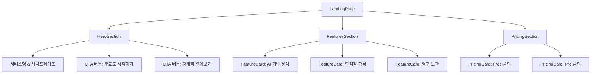

# 상태관리 설계: 랜딩 페이지 (/)

## 페이지 개요
- **경로**: `/`
- **인증 필요**: ❌
- **설명**: 서비스 소개 및 가입 유도를 위한 랜딩 페이지 (Hero, Features, Pricing 섹션)

---

## 1. 상태 데이터 목록

### 1.1 관리해야 할 상태

이 페이지는 **정적 콘텐츠 중심**이므로 **상태 관리가 필요하지 않습니다**.

- ❌ 서버 데이터 없음
- ❌ 폼 입력 없음
- ❌ 동적 UI 상태 없음

### 1.2 화면에 보여지는 데이터 (상태 아님)

| 데이터 | 타입 | 출처 | 설명 |
|--------|------|------|------|
| 서비스명 | 상수 | 코드 | "Saju맛피아" |
| 캐치프레이즈 | 상수 | 코드 | "AI가 분석하는 당신의 사주팔자" |
| Features 카드 | 상수 | 코드 | AI 기반 분석, 합리적 가격, 영구 보관 |
| Pricing 카드 | 상수 | 코드 | Free/Pro 플랜 정보 |

---

## 2. 상태 변경 조건 및 화면 변화

### 해당 없음

이 페이지는 상태 변경이 없는 **순수 프레젠테이션 컴포넌트**입니다.

---

## 3. Flux 패턴 시각화

### 해당 없음

상태 관리가 필요하지 않으므로 Flux 패턴을 적용하지 않습니다.

---

## 4. Context 설계

### 해당 없음

이 페이지는 Context를 사용하지 않습니다.

---

## 5. 컴포넌트 구조



---

## 6. 사용자 인터랙션

| 인터랙션 | 동작 | 상태 변경 |
|---------|------|-----------|
| "무료로 시작하기" 클릭 | `/sign-up`으로 이동 (Next.js Router) | ❌ |
| "자세히 알아보기" 클릭 | `/#features`로 스크롤 이동 | ❌ |
| "시작하기" 버튼 (Free) 클릭 | `/sign-up`으로 이동 | ❌ |
| "Pro 시작하기" 버튼 클릭 | `/sign-up`으로 이동 | ❌ |

---

## 7. 구현 가이드

### 7.1 컴포넌트 타입
```typescript
// 순수 프레젠테이션 컴포넌트
export default function LandingPage() {
  // 상태 없음
  // useReducer 불필요
  // Context 불필요
  
  return (
    <div>
      <HeroSection />
      <FeaturesSection />
      <PricingSection />
    </div>
  );
}
```

### 7.2 필요한 공통 모듈
- `src/constants/routes.ts`: 페이지 경로 상수
- `src/components/ui/button.tsx`: shadcn-ui Button 컴포넌트
- `src/components/ui/card.tsx`: shadcn-ui Card 컴포넌트

### 7.3 스크롤 이동 구현
```typescript
const handleScrollToFeatures = () => {
  document.getElementById('features')?.scrollIntoView({ 
    behavior: 'smooth' 
  });
};
```

---

## 8. 테스트 전략

### 8.1 단위 테스트
- ❌ 상태 로직 없음 → 단위 테스트 불필요
- ✅ 컴포넌트 렌더링 테스트만 작성

### 8.2 E2E 테스트
- ✅ "무료로 시작하기" 버튼 클릭 → `/sign-up` 이동 확인
- ✅ "자세히 알아보기" 버튼 클릭 → `#features` 스크롤 확인
- ✅ Pricing 카드 버튼 클릭 → `/sign-up` 이동 확인

---

## 9. 설계 결정 사항

### 9.1 상태 관리 불필요 이유
1. **정적 콘텐츠**: 모든 데이터가 코드에 하드코딩된 상수
2. **서버 데이터 없음**: API 호출 불필요
3. **폼 입력 없음**: 사용자 입력을 받지 않음
4. **동적 UI 없음**: 조건부 렌더링이나 토글 상태 없음

### 9.2 Context + useReducer 미사용 이유
- 상태가 없으므로 Context와 useReducer를 사용할 필요가 없습니다.
- 순수 프레젠테이션 컴포넌트로 구현합니다.

### 9.3 성능 최적화
- 정적 콘텐츠이므로 **React.memo** 불필요
- 이미지는 Next.js `<Image />` 컴포넌트 사용 (자동 최적화)
- 스크롤 이벤트 없음 (버튼 클릭 시에만 스크롤)

---

## 10. 다음 단계

1. `src/app/page.tsx` 파일 생성
2. Hero, Features, Pricing 섹션 컴포넌트 분리
3. shadcn-ui Button, Card 컴포넌트 사용
4. E2E 테스트 작성 (`tests/e2e/landing.spec.ts`)

