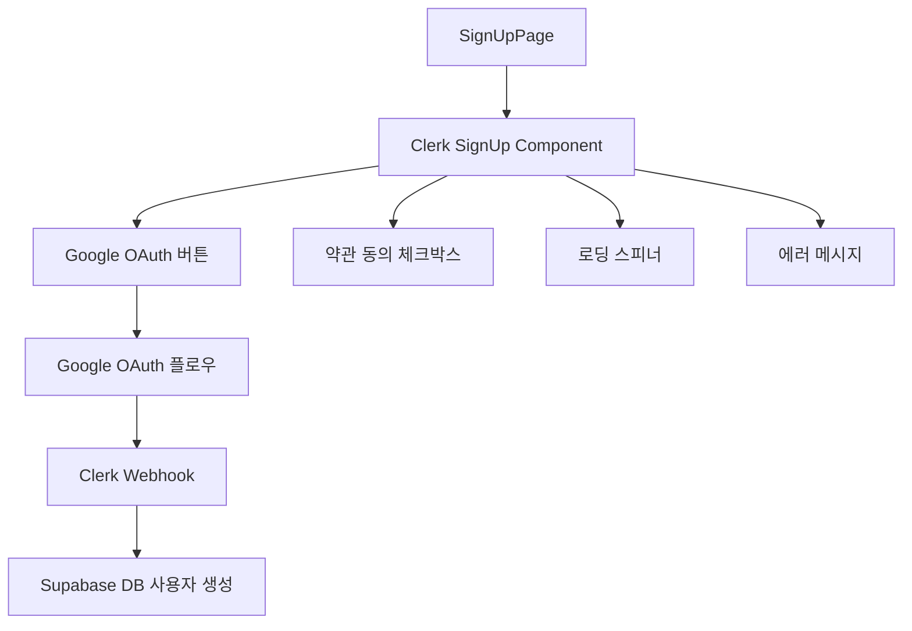
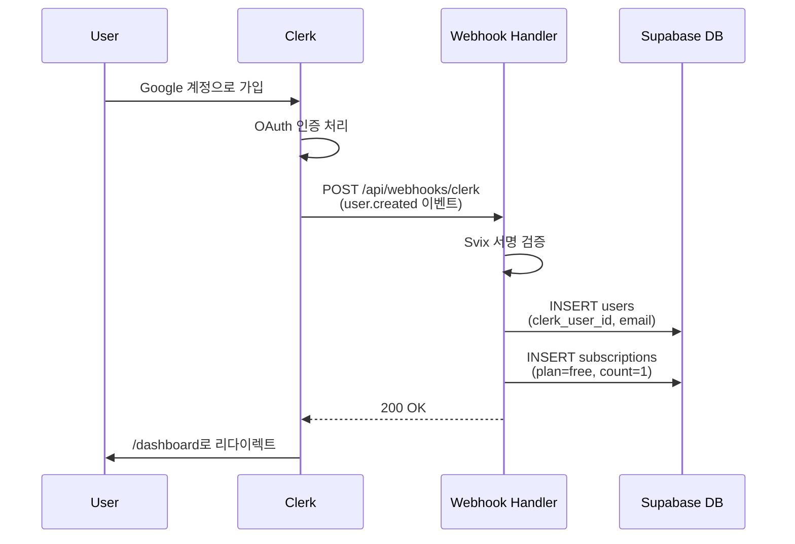

# 상태관리 설계: 회원가입 페이지 (/sign-up)

## 페이지 개요
- **경로**: `/sign-up`
- **인증 필요**: ❌
- **설명**: Clerk 제공 `<SignUp />` 컴포넌트를 사용한 Google OAuth 회원가입

---

## 1. 상태 데이터 목록

### 1.1 관리해야 할 상태

이 페이지는 **Clerk가 제공하는 완성된 UI 컴포넌트**를 사용하므로 **직접 상태 관리가 필요하지 않습니다**.

- ❌ 폼 상태: Clerk 내부에서 관리
- ❌ 로딩 상태: Clerk 내부에서 관리
- ❌ 에러 상태: Clerk 내부에서 관리

### 1.2 화면에 보여지는 데이터 (상태 아님)

| 데이터 | 타입 | 출처 | 설명 |
|--------|------|------|------|
| 회원가입 UI | 컴포넌트 | Clerk | Google OAuth 버튼, 약관 동의 등 |
| 로딩 스피너 | 컴포넌트 | Clerk | OAuth 인증 진행 중 표시 |
| 에러 메시지 | 컴포넌트 | Clerk | 인증 실패 시 표시 |

---

## 2. 상태 변경 조건 및 화면 변화

### 해당 없음

Clerk 컴포넌트가 내부적으로 모든 상태를 관리합니다.

---

## 3. Flux 패턴 시각화

### 해당 없음

Clerk 컴포넌트가 내부적으로 상태 관리를 처리하므로 Flux 패턴을 적용하지 않습니다.

---

## 4. Context 설계

### 해당 없음

이 페이지는 Context를 사용하지 않습니다. Clerk의 `ClerkProvider`는 `app/layout.tsx`에서 전역으로 제공됩니다.

---

## 5. 컴포넌트 구조



---

## 6. 사용자 인터랙션

| 인터랙션 | 동작 | 상태 변경 |
|---------|------|-----------|
| "Google로 계속하기" 클릭 | Google OAuth 팝업 열림 | ❌ (Clerk 내부) |
| Google 계정 선택 | OAuth 인증 진행 | ❌ (Clerk 내부) |
| 인증 성공 | Clerk Webhook 발생 → DB 사용자 생성 → `/dashboard` 리다이렉트 | ❌ (서버 사이드) |
| 인증 실패 | Clerk 에러 메시지 표시 | ❌ (Clerk 내부) |

---

## 7. 구현 가이드

### 7.1 컴포넌트 타입
```typescript
'use client';

import { SignUp } from '@clerk/nextjs';

export default function SignUpPage() {
  return (
    <div className="flex min-h-screen items-center justify-center">
      <SignUp 
        appearance={{
          elements: {
            // 커스텀 스타일링 (선택)
          }
        }}
        routing="path"
        path="/sign-up"
        signInUrl="/sign-in"
        afterSignUpUrl="/dashboard"
      />
    </div>
  );
}
```

### 7.2 필요한 공통 모듈
- `@clerk/nextjs`: Clerk SDK
- `src/middleware.ts`: 인증 미들웨어 (회원가입 페이지는 공개)
- `src/app/api/webhooks/clerk/route.ts`: Webhook 핸들러 (사용자 생성)

### 7.3 Clerk 설정
```typescript
// src/app/layout.tsx
import { ClerkProvider } from '@clerk/nextjs';
import { koKR } from '@clerk/localizations';

export default function RootLayout({ children }) {
  return (
    <ClerkProvider localization={koKR}>
      <html lang="ko">
        <body>{children}</body>
      </html>
    </ClerkProvider>
  );
}
```

---

## 8. 테스트 전략

### 8.1 단위 테스트
- ❌ Clerk 컴포넌트는 블랙박스 → 단위 테스트 불필요
- ✅ 컴포넌트 렌더링 테스트만 작성 (Clerk 컴포넌트가 마운트되는지 확인)

### 8.2 E2E 테스트
- ✅ 페이지 접근 가능 확인
- ✅ Clerk UI가 렌더링되는지 확인
- ❌ 실제 Google OAuth 플로우는 테스트하지 않음 (외부 서비스 의존)
- ✅ Webhook 핸들러 단위 테스트 (별도 파일)

---

## 9. 설계 결정 사항

### 9.1 상태 관리 불필요 이유
1. **Clerk 관리형 컴포넌트**: 모든 상태를 Clerk가 내부적으로 관리
2. **OAuth 플로우**: Google OAuth는 외부 서비스에서 처리
3. **서버 사이드 처리**: Webhook을 통해 서버에서 사용자 생성

### 9.2 Context + useReducer 미사용 이유
- Clerk 컴포넌트가 완전히 캡슐화되어 있어 상태 접근 불필요
- 회원가입 성공 후 리다이렉트는 Clerk가 자동 처리

### 9.3 커스터마이징 범위
- **스타일링**: `appearance` prop으로 제한적 커스터마이징 가능
- **리다이렉트**: `afterSignUpUrl` prop으로 성공 후 이동 경로 설정
- **로컬라이제이션**: `ClerkProvider`에 `koKR` 적용

---

## 10. Webhook 처리 플로우



---

## 11. 다음 단계

1. `src/app/sign-up/[[...sign-up]]/page.tsx` 파일 생성
2. Clerk `<SignUp />` 컴포넌트 통합
3. `src/app/api/webhooks/clerk/route.ts` Webhook 핸들러 구현
4. Webhook 핸들러 단위 테스트 작성
5. E2E 테스트 작성 (페이지 렌더링 확인)

