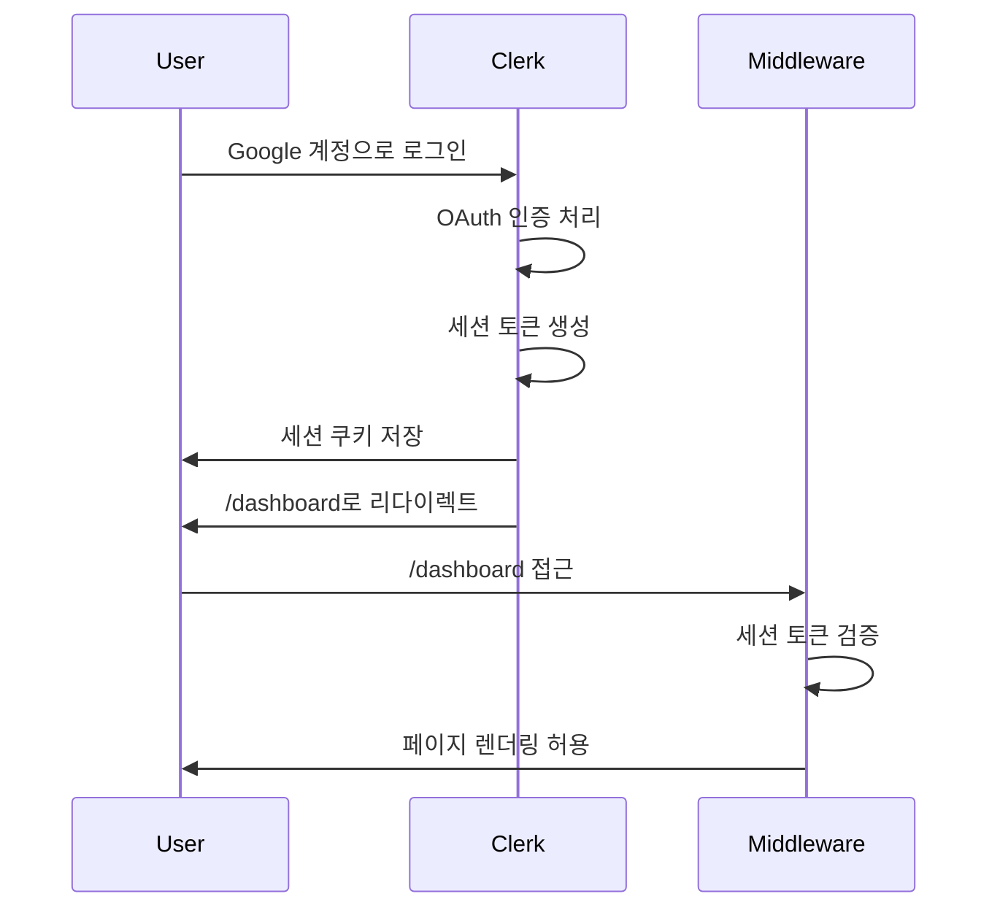

# 상태관리 설계: 로그인 페이지 (/sign-in)

## 페이지 개요
- **경로**: `/sign-in`
- **인증 필요**: ❌
- **설명**: Clerk 제공 `<SignIn />` 컴포넌트를 사용한 Google OAuth 로그인

---

## 1. 상태 데이터 목록

### 1.1 관리해야 할 상태

이 페이지는 **Clerk가 제공하는 완성된 UI 컴포넌트**를 사용하므로 **직접 상태 관리가 필요하지 않습니다**.

- ❌ 폼 상태: Clerk 내부에서 관리
- ❌ 로딩 상태: Clerk 내부에서 관리
- ❌ 에러 상태: Clerk 내부에서 관리

### 1.2 화면에 보여지는 데이터 (상태 아님)

| 데이터 | 타입 | 출처 | 설명 |
|--------|------|------|------|
| 로그인 UI | 컴포넌트 | Clerk | Google OAuth 버튼 |
| 로딩 스피너 | 컴포넌트 | Clerk | OAuth 인증 진행 중 표시 |
| 에러 메시지 | 컴포넌트 | Clerk | 인증 실패 시 표시 |

---

## 2. 상태 변경 조건 및 화면 변화

### 해당 없음

Clerk 컴포넌트가 내부적으로 모든 상태를 관리합니다.

---

## 3. Flux 패턴 시각화

### 해당 없음

Clerk 컴포넌트가 내부적으로 상태 관리를 처리하므로 Flux 패턴을 적용하지 않습니다.

---

## 4. Context 설계

### 해당 없음

이 페이지는 Context를 사용하지 않습니다. Clerk의 `ClerkProvider`는 `app/layout.tsx`에서 전역으로 제공됩니다.

---

## 5. 컴포넌트 구조

```mermaid
graph TD
    A[SignInPage] --> B[Clerk SignIn Component]
    
    B --> B1[Google OAuth 버튼]
    B --> B2[로딩 스피너]
    B --> B3[에러 메시지]
    
    B1 --> C[Google OAuth 플로우]
    C --> D[세션 생성]
    D --> E[/dashboard 리다이렉트]
```

---

## 6. 사용자 인터랙션

| 인터랙션 | 동작 | 상태 변경 |
|---------|------|-----------|
| "Google로 계속하기" 클릭 | Google OAuth 팝업 열림 | ❌ (Clerk 내부) |
| Google 계정 선택 | OAuth 인증 진행 | ❌ (Clerk 내부) |
| 인증 성공 | 세션 생성 → `/dashboard` 리다이렉트 | ❌ (Clerk 내부) |
| 인증 실패 | Clerk 에러 메시지 표시 | ❌ (Clerk 내부) |

---

## 7. 구현 가이드

### 7.1 컴포넌트 타입
```typescript
'use client';

import { SignIn } from '@clerk/nextjs';

export default function SignInPage() {
  return (
    <div className="flex min-h-screen items-center justify-center">
      <SignIn 
        appearance={{
          elements: {
            // 커스텀 스타일링 (선택)
          }
        }}
        routing="path"
        path="/sign-in"
        signUpUrl="/sign-up"
        afterSignInUrl="/dashboard"
      />
    </div>
  );
}
```

### 7.2 필요한 공통 모듈
- `@clerk/nextjs`: Clerk SDK
- `src/middleware.ts`: 인증 미들웨어 (로그인 페이지는 공개)

### 7.3 Clerk 설정
```typescript
// src/app/layout.tsx
import { ClerkProvider } from '@clerk/nextjs';
import { koKR } from '@clerk/localizations';

export default function RootLayout({ children }) {
  return (
    <ClerkProvider localization={koKR}>
      <html lang="ko">
        <body>{children}</body>
      </html>
    </ClerkProvider>
  );
}
```

---

## 8. 테스트 전략

### 8.1 단위 테스트
- ❌ Clerk 컴포넌트는 블랙박스 → 단위 테스트 불필요
- ✅ 컴포넌트 렌더링 테스트만 작성 (Clerk 컴포넌트가 마운트되는지 확인)

### 8.2 E2E 테스트
- ✅ 페이지 접근 가능 확인
- ✅ Clerk UI가 렌더링되는지 확인
- ❌ 실제 Google OAuth 플로우는 테스트하지 않음 (외부 서비스 의존)

---

## 9. 설계 결정 사항

### 9.1 상태 관리 불필요 이유
1. **Clerk 관리형 컴포넌트**: 모든 상태를 Clerk가 내부적으로 관리
2. **OAuth 플로우**: Google OAuth는 외부 서비스에서 처리
3. **세션 관리**: Clerk가 자동으로 세션 생성 및 쿠키 저장

### 9.2 Context + useReducer 미사용 이유
- Clerk 컴포넌트가 완전히 캡슐화되어 있어 상태 접근 불필요
- 로그인 성공 후 리다이렉트는 Clerk가 자동 처리

### 9.3 회원가입 페이지와의 차이점
- **Webhook 불필요**: 로그인은 기존 사용자이므로 DB 생성 불필요
- **리다이렉트만 처리**: `afterSignInUrl` prop으로 `/dashboard`로 이동

---

## 10. 로그인 플로우



---

## 11. 다음 단계

1. `src/app/sign-in/[[...sign-in]]/page.tsx` 파일 생성
2. Clerk `<SignIn />` 컴포넌트 통합
3. E2E 테스트 작성 (페이지 렌더링 확인)

