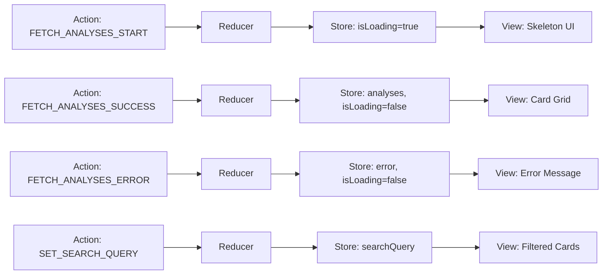
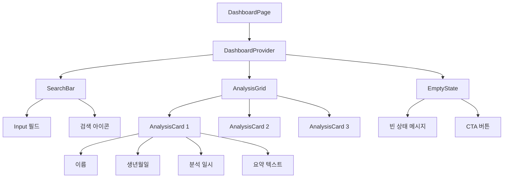
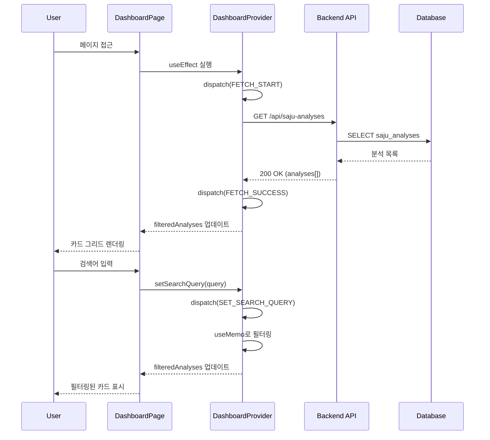

# 상태관리 설계: 대시보드 페이지 (/dashboard)

## 페이지 개요
- **경로**: `/dashboard`
- **인증 필요**: ✅
- **설명**: 사용자의 모든 사주 분석 내역을 조회하고 검색할 수 있는 페이지

---

## 1. 상태 데이터 목록

### 1.1 관리해야 할 상태

| 상태명 | 타입 | 초기값 | 설명 |
|--------|------|--------|------|
| `analyses` | `SajuAnalysis[]` | `[]` | 서버에서 가져온 분석 내역 목록 |
| `searchQuery` | `string` | `""` | 사용자가 입력한 검색어 |
| `isLoading` | `boolean` | `true` | 데이터 로딩 중 여부 |
| `error` | `string \| null` | `null` | 에러 메시지 |

### 1.2 화면에 보여지는 데이터 (상태 아님)

| 데이터 | 타입 | 계산 방식 | 설명 |
|--------|------|-----------|------|
| `filteredAnalyses` | `SajuAnalysis[]` | `analyses.filter(...)` | 검색어로 필터링된 분석 목록 |
| `isEmpty` | `boolean` | `analyses.length === 0` | 분석 내역이 없는지 여부 |
| `hasNoSearchResults` | `boolean` | `filteredAnalyses.length === 0 && searchQuery !== ""` | 검색 결과가 없는지 여부 |

---

## 2. 상태 변경 조건 및 화면 변화

| 상태 | 변경 조건 | 화면 변화 |
|------|-----------|-----------|
| `isLoading` | 페이지 마운트 시 `true` | 스켈레톤 UI 표시 |
| `isLoading` | API 응답 수신 시 `false` | 실제 데이터 렌더링 |
| `analyses` | API 응답 성공 시 데이터 저장 | 카드 그리드 렌더링 |
| `error` | API 응답 실패 시 에러 메시지 저장 | 에러 메시지 표시 |
| `searchQuery` | 사용자가 검색바에 입력 시 | 실시간 필터링된 카드 표시 |
| `filteredAnalyses` | `searchQuery` 변경 시 재계산 | 필터링된 결과만 표시 |

---

## 3. Flux 패턴 시각화



---

## 4. Context + useReducer 설계

### 4.1 State 타입 정의

```typescript
interface SajuAnalysis {
  id: string;
  name: string;
  birthDate: string;
  birthTime: string | null;
  gender: 'male' | 'female';
  modelUsed: 'gemini-2.5-flash' | 'gemini-2.5-pro';
  result: string;
  createdAt: string;
}

interface DashboardState {
  analyses: SajuAnalysis[];
  searchQuery: string;
  isLoading: boolean;
  error: string | null;
}

const initialState: DashboardState = {
  analyses: [],
  searchQuery: '',
  isLoading: true,
  error: null,
};
```

### 4.2 Action 타입 정의

```typescript
type DashboardAction =
  | { type: 'FETCH_ANALYSES_START' }
  | { type: 'FETCH_ANALYSES_SUCCESS'; payload: SajuAnalysis[] }
  | { type: 'FETCH_ANALYSES_ERROR'; payload: string }
  | { type: 'SET_SEARCH_QUERY'; payload: string };
```

### 4.3 Reducer 함수

```typescript
function dashboardReducer(
  state: DashboardState,
  action: DashboardAction
): DashboardState {
  switch (action.type) {
    case 'FETCH_ANALYSES_START':
      return { ...state, isLoading: true, error: null };
      
    case 'FETCH_ANALYSES_SUCCESS':
      return { 
        ...state, 
        analyses: action.payload, 
        isLoading: false 
      };
      
    case 'FETCH_ANALYSES_ERROR':
      return { 
        ...state, 
        error: action.payload, 
        isLoading: false 
      };
      
    case 'SET_SEARCH_QUERY':
      return { ...state, searchQuery: action.payload };
      
    default:
      return state;
  }
}
```

### 4.4 Context 생성

```typescript
interface DashboardContextValue {
  state: DashboardState;
  filteredAnalyses: SajuAnalysis[];
  setSearchQuery: (query: string) => void;
  refetch: () => Promise<void>;
}

const DashboardContext = createContext<DashboardContextValue | null>(null);
```

### 4.5 Provider 컴포넌트

```typescript
export function DashboardProvider({ children }: { children: ReactNode }) {
  const [state, dispatch] = useReducer(dashboardReducer, initialState);

  // 데이터 로드
  useEffect(() => {
    fetchAnalyses();
  }, []);

  const fetchAnalyses = async () => {
    dispatch({ type: 'FETCH_ANALYSES_START' });
    try {
      const response = await fetch('/api/saju-analyses');
      if (!response.ok) throw new Error('Failed to fetch analyses');
      const data = await response.json();
      dispatch({ type: 'FETCH_ANALYSES_SUCCESS', payload: data });
    } catch (error) {
      dispatch({ 
        type: 'FETCH_ANALYSES_ERROR', 
        payload: error.message 
      });
    }
  };

  // 검색어로 필터링
  const filteredAnalyses = useMemo(() => {
    if (!state.searchQuery) return state.analyses;
    return state.analyses.filter((analysis) =>
      analysis.name.toLowerCase().includes(state.searchQuery.toLowerCase())
    );
  }, [state.analyses, state.searchQuery]);

  const setSearchQuery = (query: string) => {
    dispatch({ type: 'SET_SEARCH_QUERY', payload: query });
  };

  const value: DashboardContextValue = {
    state,
    filteredAnalyses,
    setSearchQuery,
    refetch: fetchAnalyses,
  };

  return (
    <DashboardContext.Provider value={value}>
      {children}
    </DashboardContext.Provider>
  );
}
```

### 4.6 Custom Hook

```typescript
export function useDashboard() {
  const context = useContext(DashboardContext);
  if (!context) {
    throw new Error('useDashboard must be used within DashboardProvider');
  }
  return context;
}
```

---

## 5. 컴포넌트 구조



---

## 6. 노출할 변수 및 함수

### 6.1 Context에서 제공하는 값

| 이름 | 타입 | 설명 |
|------|------|------|
| `state.analyses` | `SajuAnalysis[]` | 전체 분석 목록 |
| `state.searchQuery` | `string` | 현재 검색어 |
| `state.isLoading` | `boolean` | 로딩 상태 |
| `state.error` | `string \| null` | 에러 메시지 |
| `filteredAnalyses` | `SajuAnalysis[]` | 필터링된 분석 목록 |
| `setSearchQuery` | `(query: string) => void` | 검색어 설정 함수 |
| `refetch` | `() => Promise<void>` | 데이터 재조회 함수 |

### 6.2 하위 컴포넌트 사용 예시

```typescript
// SearchBar.tsx
function SearchBar() {
  const { state, setSearchQuery } = useDashboard();
  
  return (
    <input
      type="text"
      value={state.searchQuery}
      onChange={(e) => setSearchQuery(e.target.value)}
      placeholder="이름으로 검색"
    />
  );
}

// AnalysisGrid.tsx
function AnalysisGrid() {
  const { state, filteredAnalyses } = useDashboard();
  
  if (state.isLoading) return <SkeletonGrid />;
  if (state.error) return <ErrorMessage error={state.error} />;
  if (filteredAnalyses.length === 0) return <EmptyState />;
  
  return (
    <div className="grid grid-cols-3 gap-4">
      {filteredAnalyses.map((analysis) => (
        <AnalysisCard key={analysis.id} analysis={analysis} />
      ))}
    </div>
  );
}
```

---

## 7. 데이터 플로우



---

## 8. 테스트 전략

### 8.1 단위 테스트 (Reducer)

```typescript
describe('dashboardReducer', () => {
  it('FETCH_ANALYSES_START: isLoading을 true로 설정', () => {
    const state = dashboardReducer(initialState, { 
      type: 'FETCH_ANALYSES_START' 
    });
    expect(state.isLoading).toBe(true);
  });

  it('FETCH_ANALYSES_SUCCESS: analyses를 저장하고 isLoading을 false로', () => {
    const analyses = [{ id: '1', name: '홍길동', ... }];
    const state = dashboardReducer(initialState, { 
      type: 'FETCH_ANALYSES_SUCCESS', 
      payload: analyses 
    });
    expect(state.analyses).toEqual(analyses);
    expect(state.isLoading).toBe(false);
  });

  it('SET_SEARCH_QUERY: searchQuery를 업데이트', () => {
    const state = dashboardReducer(initialState, { 
      type: 'SET_SEARCH_QUERY', 
      payload: '홍길동' 
    });
    expect(state.searchQuery).toBe('홍길동');
  });
});
```

### 8.2 단위 테스트 (필터링 로직)

```typescript
describe('filteredAnalyses', () => {
  it('검색어가 없으면 전체 목록 반환', () => {
    const analyses = [
      { id: '1', name: '홍길동', ... },
      { id: '2', name: '김철수', ... },
    ];
    // useMemo 로직 테스트
  });

  it('검색어로 이름 필터링', () => {
    // 필터링 로직 테스트
  });

  it('대소문자 구분 없이 검색', () => {
    // 대소문자 무시 테스트
  });
});
```

### 8.3 E2E 테스트

```typescript
test('대시보드 페이지 - 분석 목록 조회 및 검색', async ({ page }) => {
  await page.goto('/dashboard');
  
  // 로딩 스켈레톤 확인
  await expect(page.locator('[data-testid="skeleton"]')).toBeVisible();
  
  // 분석 카드 렌더링 확인
  await expect(page.locator('[data-testid="analysis-card"]')).toHaveCount(3);
  
  // 검색 기능 테스트
  await page.fill('[data-testid="search-input"]', '홍길동');
  await expect(page.locator('[data-testid="analysis-card"]')).toHaveCount(1);
  
  // 카드 클릭 시 상세 페이지 이동
  await page.click('[data-testid="analysis-card"]');
  await expect(page).toHaveURL(/\/analysis\/[a-z0-9-]+/);
});
```

---

## 9. 설계 결정 사항

### 9.1 Context + useReducer 사용 이유
1. **서버 데이터 관리**: API에서 가져온 분석 목록을 전역 상태로 관리
2. **검색 필터링**: 검색어 상태와 필터링 로직을 캡슐화
3. **하위 컴포넌트 분리**: SearchBar, AnalysisGrid 등이 독립적으로 상태 접근

### 9.2 React Query 대신 useReducer 선택 이유
- **MVP 단계**: 캐싱, 재시도 등 고급 기능 불필요
- **간단한 데이터**: 단순 조회만 필요 (mutation 없음)
- **클라이언트 필터링**: 검색은 클라이언트에서 처리

### 9.3 성능 최적화
- `useMemo`로 필터링 결과 캐싱
- 검색어 입력 시 debounce 적용 (선택)
- 카드 컴포넌트 `React.memo` 적용

---

## 10. 다음 단계

1. `src/features/dashboard/components/DashboardProvider.tsx` 생성
2. `src/features/dashboard/components/SearchBar.tsx` 생성
3. `src/features/dashboard/components/AnalysisGrid.tsx` 생성
4. `src/features/dashboard/components/AnalysisCard.tsx` 생성
5. `src/app/dashboard/page.tsx` 생성
6. Reducer 단위 테스트 작성
7. E2E 테스트 작성

