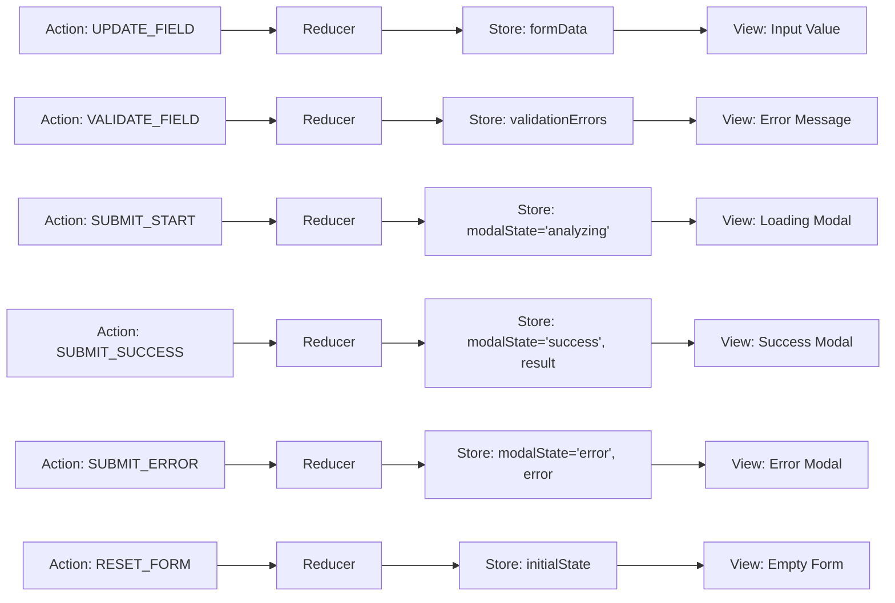
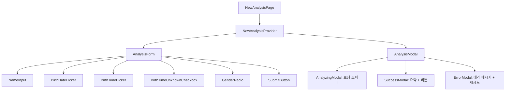
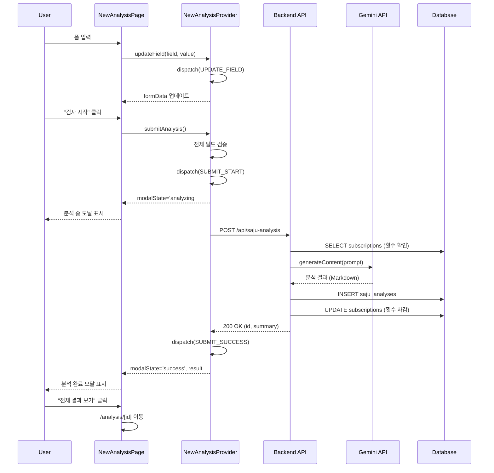

# 상태관리 설계: 새 검사 페이지 (/new-analysis)

## 페이지 개요
- **경로**: `/new-analysis`
- **인증 필요**: ✅
- **설명**: 새로운 사주 분석을 요청하는 페이지 (폼 입력 + 분석 결과 모달)

---

## 1. 상태 데이터 목록

### 1.1 관리해야 할 상태

| 상태명 | 타입 | 초기값 | 설명 |
|--------|------|--------|------|
| `formData` | `AnalysisFormData` | `{ name: '', birthDate: '', birthTime: '', gender: null, isBirthTimeUnknown: false }` | 폼 입력 데이터 |
| `validationErrors` | `Record<string, string>` | `{}` | 필드별 유효성 검증 에러 |
| `modalState` | `'idle' \| 'analyzing' \| 'success' \| 'error'` | `'idle'` | 모달 상태 |
| `analysisResult` | `AnalysisResult \| null` | `null` | 분석 결과 데이터 |
| `errorMessage` | `string \| null` | `null` | API 에러 메시지 |

### 1.2 화면에 보여지는 데이터 (상태 아님)

| 데이터 | 타입 | 계산 방식 | 설명 |
|--------|------|-----------|------|
| `isFormValid` | `boolean` | `name && birthDate && gender && Object.keys(errors).length === 0` | 폼 제출 가능 여부 |
| `canSubmit` | `boolean` | `isFormValid && modalState === 'idle'` | 제출 버튼 활성화 여부 |

---

## 2. 상태 변경 조건 및 화면 변화

| 상태 | 변경 조건 | 화면 변화 |
|------|-----------|-----------|
| `formData.name` | 사용자가 이름 입력 | 입력 필드 값 업데이트 |
| `formData.birthDate` | 사용자가 날짜 선택 | Date Picker 값 업데이트 |
| `formData.birthTime` | 사용자가 시간 입력 | Time Picker 값 업데이트 |
| `formData.isBirthTimeUnknown` | "모름" 체크박스 토글 | birthTime 필드 비활성화/활성화 |
| `formData.gender` | 사용자가 성별 선택 | Radio 버튼 선택 상태 |
| `validationErrors` | 필드 blur 또는 제출 시 검증 | 필드 하단에 에러 메시지 표시 |
| `modalState: 'analyzing'` | "검사 시작" 버튼 클릭 | 분석 중 모달 표시 (로딩 스피너) |
| `modalState: 'success'` | API 응답 성공 | 분석 완료 모달 표시 (요약 + 버튼) |
| `modalState: 'error'` | API 응답 실패 | 에러 모달 표시 (에러 메시지 + 재시도) |
| `analysisResult` | API 응답 성공 시 저장 | 모달에 결과 요약 표시 |
| `errorMessage` | API 응답 실패 시 저장 | 모달에 에러 메시지 표시 |

---

## 3. Flux 패턴 시각화



---

## 4. Context + useReducer 설계

### 4.1 State 타입 정의

```typescript
interface AnalysisFormData {
  name: string;
  birthDate: string; // YYYY-MM-DD
  birthTime: string; // HH:mm:ss 또는 빈 문자열
  gender: 'male' | 'female' | null;
  isBirthTimeUnknown: boolean;
}

interface AnalysisResult {
  id: string;
  summary: string; // 첫 3-4줄
}

interface NewAnalysisState {
  formData: AnalysisFormData;
  validationErrors: Record<string, string>;
  modalState: 'idle' | 'analyzing' | 'success' | 'error';
  analysisResult: AnalysisResult | null;
  errorMessage: string | null;
}

const initialState: NewAnalysisState = {
  formData: {
    name: '',
    birthDate: '',
    birthTime: '',
    gender: null,
    isBirthTimeUnknown: false,
  },
  validationErrors: {},
  modalState: 'idle',
  analysisResult: null,
  errorMessage: null,
};
```

### 4.2 Action 타입 정의

```typescript
type NewAnalysisAction =
  | { type: 'UPDATE_FIELD'; field: keyof AnalysisFormData; value: any }
  | { type: 'VALIDATE_FIELD'; field: string; error: string | null }
  | { type: 'SUBMIT_START' }
  | { type: 'SUBMIT_SUCCESS'; payload: AnalysisResult }
  | { type: 'SUBMIT_ERROR'; payload: string }
  | { type: 'CLOSE_MODAL' }
  | { type: 'RESET_FORM' };
```

### 4.3 Reducer 함수

```typescript
function newAnalysisReducer(
  state: NewAnalysisState,
  action: NewAnalysisAction
): NewAnalysisState {
  switch (action.type) {
    case 'UPDATE_FIELD':
      return {
        ...state,
        formData: {
          ...state.formData,
          [action.field]: action.value,
        },
      };

    case 'VALIDATE_FIELD':
      const { [action.field]: _, ...rest } = state.validationErrors;
      return {
        ...state,
        validationErrors: action.error
          ? { ...state.validationErrors, [action.field]: action.error }
          : rest,
      };

    case 'SUBMIT_START':
      return {
        ...state,
        modalState: 'analyzing',
        errorMessage: null,
      };

    case 'SUBMIT_SUCCESS':
      return {
        ...state,
        modalState: 'success',
        analysisResult: action.payload,
      };

    case 'SUBMIT_ERROR':
      return {
        ...state,
        modalState: 'error',
        errorMessage: action.payload,
      };

    case 'CLOSE_MODAL':
      return {
        ...state,
        modalState: 'idle',
      };

    case 'RESET_FORM':
      return initialState;

    default:
      return state;
  }
}
```

### 4.4 Context 생성

```typescript
interface NewAnalysisContextValue {
  state: NewAnalysisState;
  updateField: (field: keyof AnalysisFormData, value: any) => void;
  validateField: (field: string) => void;
  submitAnalysis: () => Promise<void>;
  closeModal: () => void;
  resetForm: () => void;
}

const NewAnalysisContext = createContext<NewAnalysisContextValue | null>(null);
```

### 4.5 Provider 컴포넌트

```typescript
export function NewAnalysisProvider({ children }: { children: ReactNode }) {
  const [state, dispatch] = useReducer(newAnalysisReducer, initialState);

  const updateField = (field: keyof AnalysisFormData, value: any) => {
    dispatch({ type: 'UPDATE_FIELD', field, value });
    
    // 출생 시간 모름 체크 시 birthTime 초기화
    if (field === 'isBirthTimeUnknown' && value === true) {
      dispatch({ type: 'UPDATE_FIELD', field: 'birthTime', value: '' });
    }
  };

  const validateField = (field: string) => {
    const value = state.formData[field as keyof AnalysisFormData];
    let error: string | null = null;

    switch (field) {
      case 'name':
        if (!value) error = '이름을 입력해주세요';
        break;
      case 'birthDate':
        if (!value) error = '생년월일을 선택해주세요';
        break;
      case 'gender':
        if (!value) error = '성별을 선택해주세요';
        break;
    }

    dispatch({ type: 'VALIDATE_FIELD', field, error });
  };

  const submitAnalysis = async () => {
    // 전체 필드 검증
    ['name', 'birthDate', 'gender'].forEach(validateField);
    
    if (Object.keys(state.validationErrors).length > 0) return;

    dispatch({ type: 'SUBMIT_START' });

    try {
      const response = await fetch('/api/saju-analysis', {
        method: 'POST',
        headers: { 'Content-Type': 'application/json' },
        body: JSON.stringify(state.formData),
      });

      if (!response.ok) {
        const error = await response.json();
        throw new Error(error.message || '분석 요청에 실패했습니다');
      }

      const result = await response.json();
      dispatch({ type: 'SUBMIT_SUCCESS', payload: result });
    } catch (error) {
      dispatch({ 
        type: 'SUBMIT_ERROR', 
        payload: error.message 
      });
    }
  };

  const closeModal = () => {
    dispatch({ type: 'CLOSE_MODAL' });
  };

  const resetForm = () => {
    dispatch({ type: 'RESET_FORM' });
  };

  const value: NewAnalysisContextValue = {
    state,
    updateField,
    validateField,
    submitAnalysis,
    closeModal,
    resetForm,
  };

  return (
    <NewAnalysisContext.Provider value={value}>
      {children}
    </NewAnalysisContext.Provider>
  );
}
```

### 4.6 Custom Hook

```typescript
export function useNewAnalysis() {
  const context = useContext(NewAnalysisContext);
  if (!context) {
    throw new Error('useNewAnalysis must be used within NewAnalysisProvider');
  }
  return context;
}
```

---

## 5. 컴포넌트 구조



---

## 6. 노출할 변수 및 함수

### 6.1 Context에서 제공하는 값

| 이름 | 타입 | 설명 |
|------|------|------|
| `state.formData` | `AnalysisFormData` | 폼 입력 데이터 |
| `state.validationErrors` | `Record<string, string>` | 필드별 에러 메시지 |
| `state.modalState` | `'idle' \| 'analyzing' \| 'success' \| 'error'` | 모달 상태 |
| `state.analysisResult` | `AnalysisResult \| null` | 분석 결과 |
| `state.errorMessage` | `string \| null` | API 에러 메시지 |
| `updateField` | `(field, value) => void` | 필드 값 업데이트 |
| `validateField` | `(field) => void` | 필드 유효성 검증 |
| `submitAnalysis` | `() => Promise<void>` | 분석 요청 제출 |
| `closeModal` | `() => void` | 모달 닫기 |
| `resetForm` | `() => void` | 폼 초기화 |

### 6.2 하위 컴포넌트 사용 예시

```typescript
// NameInput.tsx
function NameInput() {
  const { state, updateField, validateField } = useNewAnalysis();
  
  return (
    <div>
      <input
        type="text"
        value={state.formData.name}
        onChange={(e) => updateField('name', e.target.value)}
        onBlur={() => validateField('name')}
      />
      {state.validationErrors.name && (
        <span className="error">{state.validationErrors.name}</span>
      )}
    </div>
  );
}

// SubmitButton.tsx
function SubmitButton() {
  const { state, submitAnalysis } = useNewAnalysis();
  
  const isFormValid = 
    state.formData.name &&
    state.formData.birthDate &&
    state.formData.gender &&
    Object.keys(state.validationErrors).length === 0;
  
  return (
    <button
      onClick={submitAnalysis}
      disabled={!isFormValid || state.modalState !== 'idle'}
    >
      검사 시작
    </button>
  );
}

// AnalysisModal.tsx
function AnalysisModal() {
  const { state, closeModal } = useNewAnalysis();
  const router = useRouter();
  
  if (state.modalState === 'idle') return null;
  
  return (
    <Dialog open={state.modalState !== 'idle'}>
      {state.modalState === 'analyzing' && <LoadingSpinner />}
      {state.modalState === 'success' && (
        <>
          <p>{state.analysisResult?.summary}</p>
          <button onClick={() => router.push(`/analysis/${state.analysisResult?.id}`)}>
            전체 결과 보기
          </button>
        </>
      )}
      {state.modalState === 'error' && (
        <>
          <p>{state.errorMessage}</p>
          <button onClick={closeModal}>닫기</button>
        </>
      )}
    </Dialog>
  );
}
```

---

## 7. 데이터 플로우



---

## 8. 테스트 전략

### 8.1 단위 테스트 (Reducer)

```typescript
describe('newAnalysisReducer', () => {
  it('UPDATE_FIELD: 필드 값 업데이트', () => {
    const state = newAnalysisReducer(initialState, {
      type: 'UPDATE_FIELD',
      field: 'name',
      value: '홍길동',
    });
    expect(state.formData.name).toBe('홍길동');
  });

  it('VALIDATE_FIELD: 에러 추가', () => {
    const state = newAnalysisReducer(initialState, {
      type: 'VALIDATE_FIELD',
      field: 'name',
      error: '이름을 입력해주세요',
    });
    expect(state.validationErrors.name).toBe('이름을 입력해주세요');
  });

  it('SUBMIT_START: modalState를 analyzing으로 변경', () => {
    const state = newAnalysisReducer(initialState, {
      type: 'SUBMIT_START',
    });
    expect(state.modalState).toBe('analyzing');
  });

  it('SUBMIT_SUCCESS: 결과 저장 및 modalState 변경', () => {
    const result = { id: '123', summary: '요약' };
    const state = newAnalysisReducer(initialState, {
      type: 'SUBMIT_SUCCESS',
      payload: result,
    });
    expect(state.modalState).toBe('success');
    expect(state.analysisResult).toEqual(result);
  });
});
```

### 8.2 단위 테스트 (유효성 검증)

```typescript
describe('validateField', () => {
  it('이름이 비어있으면 에러 반환', () => {
    // validateField 로직 테스트
  });

  it('생년월일이 비어있으면 에러 반환', () => {
    // validateField 로직 테스트
  });

  it('성별이 선택되지 않으면 에러 반환', () => {
    // validateField 로직 테스트
  });
});
```

### 8.3 E2E 테스트

```typescript
test('새 검사 페이지 - 분석 요청 플로우', async ({ page }) => {
  await page.goto('/new-analysis');
  
  // 폼 입력
  await page.fill('[data-testid="name-input"]', '홍길동');
  await page.fill('[data-testid="birth-date"]', '1990-01-01');
  await page.click('[data-testid="gender-male"]');
  
  // 제출
  await page.click('[data-testid="submit-button"]');
  
  // 분석 중 모달 확인
  await expect(page.locator('[data-testid="analyzing-modal"]')).toBeVisible();
  
  // 분석 완료 모달 확인
  await expect(page.locator('[data-testid="success-modal"]')).toBeVisible({ timeout: 30000 });
  
  // 전체 결과 보기 클릭
  await page.click('[data-testid="view-full-result"]');
  await expect(page).toHaveURL(/\/analysis\/[a-z0-9-]+/);
});
```

---

## 9. 설계 결정 사항

### 9.1 Context + useReducer 사용 이유
1. **복잡한 폼 상태**: 5개 필드 + 유효성 검증 + 모달 상태
2. **비동기 처리**: API 호출 및 로딩/성공/에러 상태 관리
3. **하위 컴포넌트 분리**: 각 입력 필드를 독립 컴포넌트로 분리

### 9.2 React Hook Form 대신 useReducer 선택 이유
- **MVP 단계**: 간단한 폼이므로 라이브러리 불필요
- **학습 곡선**: useReducer가 더 직관적
- **커스터마이징**: 모달 상태와 폼 상태를 하나의 reducer로 통합

### 9.3 모달 상태 관리
- `modalState`로 4가지 상태 관리: idle, analyzing, success, error
- 조건부 렌더링으로 모달 UI 전환

---

## 10. 다음 단계

1. `src/features/new-analysis/components/NewAnalysisProvider.tsx` 생성
2. `src/features/new-analysis/components/AnalysisForm.tsx` 생성
3. `src/features/new-analysis/components/AnalysisModal.tsx` 생성
4. `src/app/new-analysis/page.tsx` 생성
5. Reducer 단위 테스트 작성
6. 유효성 검증 로직 테스트 작성
7. E2E 테스트 작성

