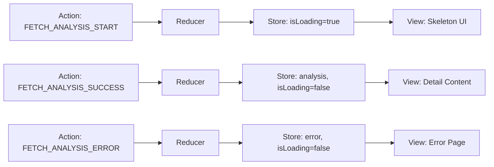
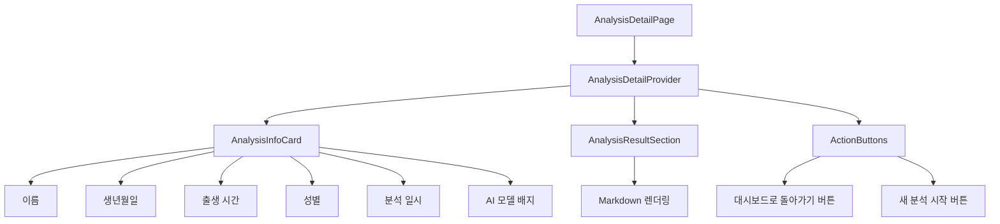
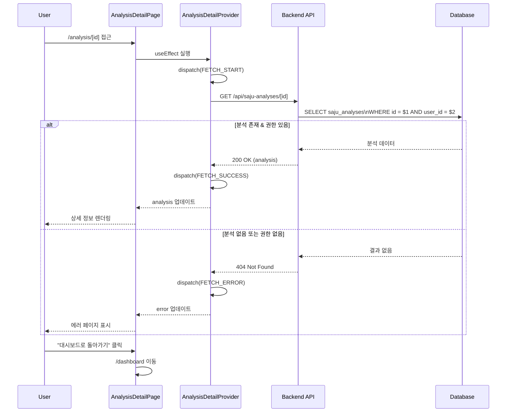

# 상태관리 설계: 분석 상세보기 페이지 (/analysis/[id])

## 페이지 개요
- **경로**: `/analysis/[id]`
- **인증 필요**: ✅
- **설명**: 특정 사주 분석 결과를 상세하게 조회하는 페이지

---

## 1. 상태 데이터 목록

### 1.1 관리해야 할 상태

| 상태명 | 타입 | 초기값 | 설명 |
|--------|------|--------|------|
| `analysis` | `AnalysisDetail \| null` | `null` | 분석 상세 데이터 |
| `isLoading` | `boolean` | `true` | 데이터 로딩 중 여부 |
| `error` | `string \| null` | `null` | 에러 메시지 (404, 403, 500 등) |

### 1.2 화면에 보여지는 데이터 (상태 아님)

| 데이터 | 타입 | 계산 방식 | 설명 |
|--------|------|-----------|------|
| `formattedBirthDate` | `string` | `formatDate(analysis.birthDate)` | 한국어 형식 날짜 |
| `formattedCreatedAt` | `string` | `formatDateTime(analysis.createdAt)` | 한국어 형식 일시 |
| `modelBadge` | `string` | `analysis.modelUsed === 'gemini-2.5-pro' ? 'Pro' : 'Flash'` | AI 모델 배지 텍스트 |
| `renderedResult` | `ReactNode` | `markdownToHtml(analysis.result)` | Markdown → HTML 변환 결과 |

---

## 2. 상태 변경 조건 및 화면 변화

| 상태 | 변경 조건 | 화면 변화 |
|------|-----------|-----------|
| `isLoading` | 페이지 마운트 시 `true` | 스켈레톤 UI 표시 |
| `isLoading` | API 응답 수신 시 `false` | 실제 데이터 렌더링 |
| `analysis` | API 응답 성공 시 데이터 저장 | 대상자 정보 + 분석 결과 표시 |
| `error` | API 응답 실패 시 에러 메시지 저장 | 에러 페이지 표시 (404, 403, 500) |

---

## 3. Flux 패턴 시각화



---

## 4. Context + useReducer 설계

### 4.1 State 타입 정의

```typescript
interface AnalysisDetail {
  id: string;
  name: string;
  birthDate: string; // YYYY-MM-DD
  birthTime: string | null; // HH:mm:ss 또는 null
  gender: 'male' | 'female';
  modelUsed: 'gemini-2.5-flash' | 'gemini-2.5-pro';
  result: string; // Markdown 형식
  createdAt: string; // ISO 8601
}

interface AnalysisDetailState {
  analysis: AnalysisDetail | null;
  isLoading: boolean;
  error: string | null;
}

const initialState: AnalysisDetailState = {
  analysis: null,
  isLoading: true,
  error: null,
};
```

### 4.2 Action 타입 정의

```typescript
type AnalysisDetailAction =
  | { type: 'FETCH_ANALYSIS_START' }
  | { type: 'FETCH_ANALYSIS_SUCCESS'; payload: AnalysisDetail }
  | { type: 'FETCH_ANALYSIS_ERROR'; payload: string };
```

### 4.3 Reducer 함수

```typescript
function analysisDetailReducer(
  state: AnalysisDetailState,
  action: AnalysisDetailAction
): AnalysisDetailState {
  switch (action.type) {
    case 'FETCH_ANALYSIS_START':
      return { ...state, isLoading: true, error: null };

    case 'FETCH_ANALYSIS_SUCCESS':
      return {
        ...state,
        analysis: action.payload,
        isLoading: false,
      };

    case 'FETCH_ANALYSIS_ERROR':
      return {
        ...state,
        error: action.payload,
        isLoading: false,
      };

    default:
      return state;
  }
}
```

### 4.4 Context 생성

```typescript
interface AnalysisDetailContextValue {
  state: AnalysisDetailState;
  refetch: () => Promise<void>;
}

const AnalysisDetailContext = createContext<AnalysisDetailContextValue | null>(null);
```

### 4.5 Provider 컴포넌트

```typescript
export function AnalysisDetailProvider({ 
  analysisId, 
  children 
}: { 
  analysisId: string; 
  children: ReactNode;
}) {
  const [state, dispatch] = useReducer(analysisDetailReducer, initialState);

  const fetchAnalysis = async () => {
    dispatch({ type: 'FETCH_ANALYSIS_START' });
    try {
      const response = await fetch(`/api/saju-analyses/${analysisId}`);
      
      if (response.status === 404) {
        throw new Error('분석을 찾을 수 없습니다');
      }
      if (response.status === 403) {
        throw new Error('접근 권한이 없습니다');
      }
      if (!response.ok) {
        throw new Error('분석을 불러오는데 실패했습니다');
      }

      const data = await response.json();
      dispatch({ type: 'FETCH_ANALYSIS_SUCCESS', payload: data });
    } catch (error) {
      dispatch({
        type: 'FETCH_ANALYSIS_ERROR',
        payload: error.message,
      });
    }
  };

  useEffect(() => {
    fetchAnalysis();
  }, [analysisId]);

  const value: AnalysisDetailContextValue = {
    state,
    refetch: fetchAnalysis,
  };

  return (
    <AnalysisDetailContext.Provider value={value}>
      {children}
    </AnalysisDetailContext.Provider>
  );
}
```

### 4.6 Custom Hook

```typescript
export function useAnalysisDetail() {
  const context = useContext(AnalysisDetailContext);
  if (!context) {
    throw new Error('useAnalysisDetail must be used within AnalysisDetailProvider');
  }
  return context;
}
```

---

## 5. 컴포넌트 구조



---

## 6. 노출할 변수 및 함수

### 6.1 Context에서 제공하는 값

| 이름 | 타입 | 설명 |
|------|------|------|
| `state.analysis` | `AnalysisDetail \| null` | 분석 상세 데이터 |
| `state.isLoading` | `boolean` | 로딩 상태 |
| `state.error` | `string \| null` | 에러 메시지 |
| `refetch` | `() => Promise<void>` | 데이터 재조회 함수 |

### 6.2 하위 컴포넌트 사용 예시

```typescript
// AnalysisInfoCard.tsx
function AnalysisInfoCard() {
  const { state } = useAnalysisDetail();
  
  if (state.isLoading) return <Skeleton />;
  if (state.error || !state.analysis) return null;
  
  const { analysis } = state;
  
  return (
    <Card>
      <h2>{analysis.name}</h2>
      <p>생년월일: {formatDate(analysis.birthDate)}</p>
      {analysis.birthTime && (
        <p>출생 시간: {analysis.birthTime}</p>
      )}
      <p>성별: {analysis.gender === 'male' ? '남성' : '여성'}</p>
      <p>분석 일시: {formatDateTime(analysis.createdAt)}</p>
      <Badge>{analysis.modelUsed.includes('pro') ? 'Pro' : 'Flash'}</Badge>
    </Card>
  );
}

// AnalysisResultSection.tsx
function AnalysisResultSection() {
  const { state } = useAnalysisDetail();
  
  if (state.isLoading) return <Skeleton />;
  if (state.error || !state.analysis) return null;
  
  return (
    <div 
      className="prose" 
      dangerouslySetInnerHTML={{ 
        __html: markdownToHtml(state.analysis.result) 
      }} 
    />
  );
}

// ErrorPage.tsx
function ErrorPage() {
  const { state } = useAnalysisDetail();
  const router = useRouter();
  
  if (!state.error) return null;
  
  return (
    <div>
      <h1>오류가 발생했습니다</h1>
      <p>{state.error}</p>
      <button onClick={() => router.push('/dashboard')}>
        대시보드로 돌아가기
      </button>
    </div>
  );
}
```

---

## 7. 데이터 플로우



---

## 8. 테스트 전략

### 8.1 단위 테스트 (Reducer)

```typescript
describe('analysisDetailReducer', () => {
  it('FETCH_ANALYSIS_START: isLoading을 true로 설정', () => {
    const state = analysisDetailReducer(initialState, {
      type: 'FETCH_ANALYSIS_START',
    });
    expect(state.isLoading).toBe(true);
  });

  it('FETCH_ANALYSIS_SUCCESS: analysis를 저장하고 isLoading을 false로', () => {
    const analysis = {
      id: '123',
      name: '홍길동',
      birthDate: '1990-01-01',
      birthTime: null,
      gender: 'male',
      modelUsed: 'gemini-2.5-flash',
      result: '# 분석 결과',
      createdAt: '2025-01-01T00:00:00Z',
    };
    const state = analysisDetailReducer(initialState, {
      type: 'FETCH_ANALYSIS_SUCCESS',
      payload: analysis,
    });
    expect(state.analysis).toEqual(analysis);
    expect(state.isLoading).toBe(false);
  });

  it('FETCH_ANALYSIS_ERROR: error를 저장하고 isLoading을 false로', () => {
    const state = analysisDetailReducer(initialState, {
      type: 'FETCH_ANALYSIS_ERROR',
      payload: '분석을 찾을 수 없습니다',
    });
    expect(state.error).toBe('분석을 찾을 수 없습니다');
    expect(state.isLoading).toBe(false);
  });
});
```

### 8.2 단위 테스트 (Markdown 렌더링)

```typescript
describe('markdownToHtml', () => {
  it('Markdown을 HTML로 변환', () => {
    const markdown = '# 제목\n\n본문';
    const html = markdownToHtml(markdown);
    expect(html).toContain('<h1>제목</h1>');
    expect(html).toContain('<p>본문</p>');
  });
});
```

### 8.3 E2E 테스트

```typescript
test('분석 상세보기 페이지 - 정상 조회', async ({ page }) => {
  await page.goto('/analysis/123');
  
  // 로딩 스켈레톤 확인
  await expect(page.locator('[data-testid="skeleton"]')).toBeVisible();
  
  // 분석 정보 렌더링 확인
  await expect(page.locator('[data-testid="analysis-name"]')).toHaveText('홍길동');
  await expect(page.locator('[data-testid="analysis-result"]')).toBeVisible();
  
  // 대시보드로 돌아가기 버튼 클릭
  await page.click('[data-testid="back-to-dashboard"]');
  await expect(page).toHaveURL('/dashboard');
});

test('분석 상세보기 페이지 - 404 에러', async ({ page }) => {
  await page.goto('/analysis/invalid-id');
  
  // 에러 메시지 확인
  await expect(page.locator('[data-testid="error-message"]')).toHaveText('분석을 찾을 수 없습니다');
});
```

---

## 9. 설계 결정 사항

### 9.1 Context + useReducer 사용 이유
1. **서버 데이터 관리**: API에서 가져온 분석 데이터를 전역 상태로 관리
2. **에러 처리**: 404, 403 등 다양한 에러 상태를 명확하게 관리
3. **하위 컴포넌트 분리**: InfoCard, ResultSection 등이 독립적으로 상태 접근

### 9.2 React Query 대신 useReducer 선택 이유
- **MVP 단계**: 단순 조회만 필요 (mutation 없음)
- **읽기 전용 데이터**: 분석 결과는 수정되지 않음
- **간단한 캐싱**: 페이지 이탈 시 캐시 불필요

### 9.3 Markdown 렌더링
- `dangerouslySetInnerHTML` 사용 (서버에서 생성한 신뢰할 수 있는 데이터)
- `prose` 클래스로 Tailwind Typography 적용
- XSS 방지: 서버에서 Markdown 생성 시 sanitize

---

## 10. 다음 단계

1. `src/features/analysis-detail/components/AnalysisDetailProvider.tsx` 생성
2. `src/features/analysis-detail/components/AnalysisInfoCard.tsx` 생성
3. `src/features/analysis-detail/components/AnalysisResultSection.tsx` 생성
4. `src/app/analysis/[id]/page.tsx` 생성
5. `src/lib/utils/markdown.ts` Markdown → HTML 유틸리티 생성
6. Reducer 단위 테스트 작성
7. E2E 테스트 작성

