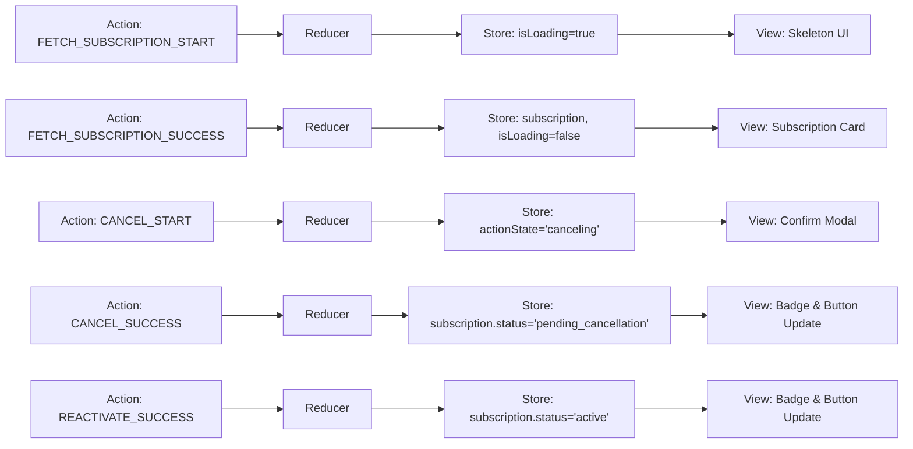
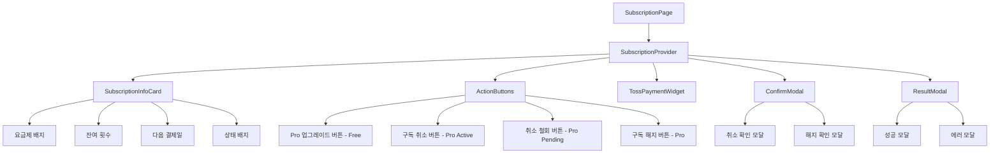
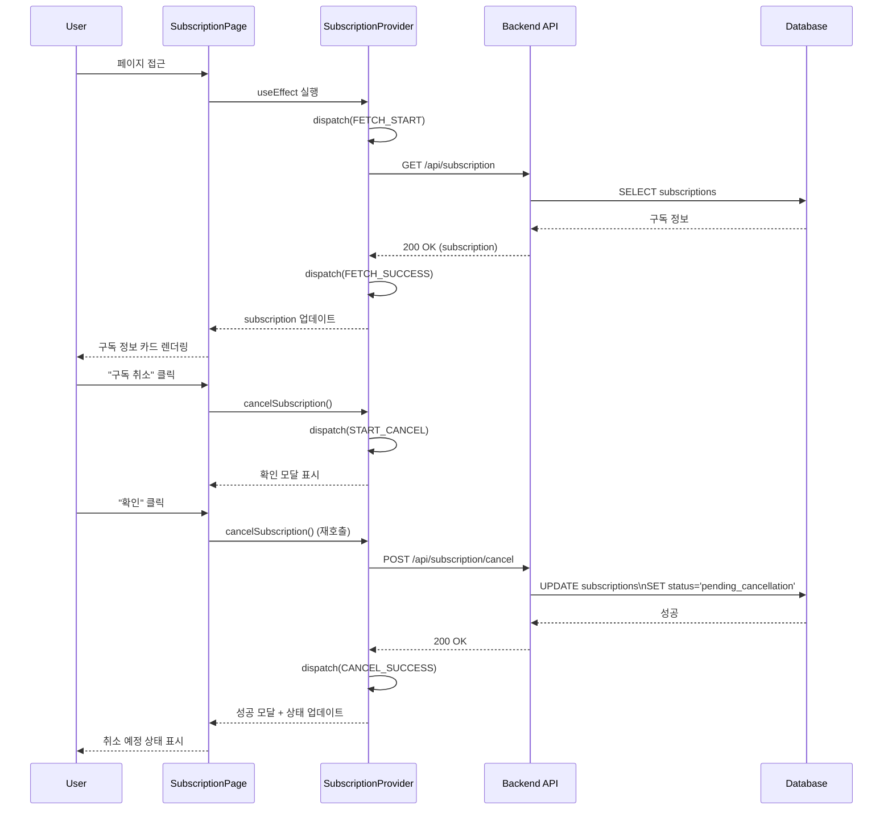

# 상태관리 설계: 구독 관리 페이지 (/subscription)

## 페이지 개요
- **경로**: `/subscription`
- **인증 필요**: ✅
- **설명**: 현재 구독 정보 조회 및 Pro 업그레이드, 구독 취소/철회/해지 기능 제공

---

## 1. 상태 데이터 목록

### 1.1 관리해야 할 상태

| 상태명 | 타입 | 초기값 | 설명 |
|--------|------|--------|------|
| `subscription` | `SubscriptionInfo \| null` | `null` | 구독 정보 |
| `isLoading` | `boolean` | `true` | 데이터 로딩 중 여부 |
| `error` | `string \| null` | `null` | 에러 메시지 |
| `actionState` | `'idle' \| 'upgrading' \| 'canceling' \| 'reactivating' \| 'terminating'` | `'idle'` | 현재 진행 중인 액션 |
| `modalState` | `ModalState` | `{ type: 'none' }` | 모달 상태 (확인, 성공, 에러) |

### 1.2 화면에 보여지는 데이터 (상태 아님)

| 데이터 | 타입 | 계산 방식 | 설명 |
|--------|------|-----------|------|
| `isFree` | `boolean` | `subscription.plan === 'free'` | Free 플랜 여부 |
| `isPro` | `boolean` | `subscription.plan === 'pro'` | Pro 플랜 여부 |
| `isActive` | `boolean` | `subscription.status === 'active'` | 활성 상태 여부 |
| `isPendingCancellation` | `boolean` | `subscription.status === 'pending_cancellation'` | 취소 예정 상태 여부 |
| `formattedNextBillingDate` | `string` | `formatDate(subscription.nextBillingDate)` | 한국어 형식 날짜 |
| `statusBadgeColor` | `string` | 상태에 따라 색상 결정 | 배지 색상 (초록/주황) |

---

## 2. 상태 변경 조건 및 화면 변화

| 상태 | 변경 조건 | 화면 변화 |
|------|-----------|-----------|
| `isLoading` | 페이지 마운트 시 `true` | 스켈레톤 UI 표시 |
| `isLoading` | API 응답 수신 시 `false` | 실제 데이터 렌더링 |
| `subscription` | API 응답 성공 시 데이터 저장 | 구독 정보 카드 표시 |
| `error` | API 응답 실패 시 에러 메시지 저장 | 에러 메시지 표시 |
| `actionState: 'upgrading'` | "Pro 업그레이드" 클릭 시 | 토스 결제 위젯 표시 |
| `actionState: 'canceling'` | "구독 취소" 클릭 시 | 확인 모달 표시 |
| `actionState: 'reactivating'` | "취소 철회" 클릭 시 | 로딩 스피너 표시 |
| `actionState: 'terminating'` | "구독 해지" 클릭 시 | 확인 모달 표시 |
| `modalState` | 액션 성공/실패 시 | 성공/에러 모달 표시 |
| `subscription.status` | 취소/철회 성공 시 | 배지 색상 및 버튼 변경 |

---

## 3. Flux 패턴 시각화



---

## 4. Context + useReducer 설계

### 4.1 State 타입 정의

```typescript
interface SubscriptionInfo {
  plan: 'free' | 'pro';
  status: 'active' | 'pending_cancellation';
  remainingCount: number;
  nextBillingDate: string | null; // YYYY-MM-DD 또는 null
}

type ModalState =
  | { type: 'none' }
  | { type: 'confirm_cancel' }
  | { type: 'confirm_terminate' }
  | { type: 'success'; message: string }
  | { type: 'error'; message: string };

interface SubscriptionState {
  subscription: SubscriptionInfo | null;
  isLoading: boolean;
  error: string | null;
  actionState: 'idle' | 'upgrading' | 'canceling' | 'reactivating' | 'terminating';
  modalState: ModalState;
}

const initialState: SubscriptionState = {
  subscription: null,
  isLoading: true,
  error: null,
  actionState: 'idle',
  modalState: { type: 'none' },
};
```

### 4.2 Action 타입 정의

```typescript
type SubscriptionAction =
  | { type: 'FETCH_SUBSCRIPTION_START' }
  | { type: 'FETCH_SUBSCRIPTION_SUCCESS'; payload: SubscriptionInfo }
  | { type: 'FETCH_SUBSCRIPTION_ERROR'; payload: string }
  | { type: 'START_UPGRADE' }
  | { type: 'START_CANCEL' }
  | { type: 'CONFIRM_CANCEL' }
  | { type: 'CANCEL_SUCCESS' }
  | { type: 'START_REACTIVATE' }
  | { type: 'REACTIVATE_SUCCESS' }
  | { type: 'START_TERMINATE' }
  | { type: 'CONFIRM_TERMINATE' }
  | { type: 'TERMINATE_SUCCESS' }
  | { type: 'ACTION_ERROR'; payload: string }
  | { type: 'CLOSE_MODAL' }
  | { type: 'RESET_ACTION' };
```

### 4.3 Reducer 함수

```typescript
function subscriptionReducer(
  state: SubscriptionState,
  action: SubscriptionAction
): SubscriptionState {
  switch (action.type) {
    case 'FETCH_SUBSCRIPTION_START':
      return { ...state, isLoading: true, error: null };

    case 'FETCH_SUBSCRIPTION_SUCCESS':
      return {
        ...state,
        subscription: action.payload,
        isLoading: false,
      };

    case 'FETCH_SUBSCRIPTION_ERROR':
      return {
        ...state,
        error: action.payload,
        isLoading: false,
      };

    case 'START_UPGRADE':
      return { ...state, actionState: 'upgrading' };

    case 'START_CANCEL':
      return {
        ...state,
        actionState: 'canceling',
        modalState: { type: 'confirm_cancel' },
      };

    case 'CONFIRM_CANCEL':
      return { ...state, actionState: 'canceling' };

    case 'CANCEL_SUCCESS':
      return {
        ...state,
        subscription: state.subscription
          ? { ...state.subscription, status: 'pending_cancellation' }
          : null,
        actionState: 'idle',
        modalState: { type: 'success', message: '구독이 취소 예정되었습니다' },
      };

    case 'START_REACTIVATE':
      return { ...state, actionState: 'reactivating' };

    case 'REACTIVATE_SUCCESS':
      return {
        ...state,
        subscription: state.subscription
          ? { ...state.subscription, status: 'active' }
          : null,
        actionState: 'idle',
        modalState: { type: 'success', message: '구독이 재활성화되었습니다' },
      };

    case 'START_TERMINATE':
      return {
        ...state,
        actionState: 'terminating',
        modalState: { type: 'confirm_terminate' },
      };

    case 'CONFIRM_TERMINATE':
      return { ...state, actionState: 'terminating' };

    case 'TERMINATE_SUCCESS':
      return {
        ...state,
        subscription: state.subscription
          ? {
              plan: 'free',
              status: 'active',
              remainingCount: 0,
              nextBillingDate: null,
            }
          : null,
        actionState: 'idle',
        modalState: { type: 'success', message: '구독이 해지되었습니다' },
      };

    case 'ACTION_ERROR':
      return {
        ...state,
        actionState: 'idle',
        modalState: { type: 'error', message: action.payload },
      };

    case 'CLOSE_MODAL':
      return { ...state, modalState: { type: 'none' } };

    case 'RESET_ACTION':
      return { ...state, actionState: 'idle' };

    default:
      return state;
  }
}
```

### 4.4 Context 생성

```typescript
interface SubscriptionContextValue {
  state: SubscriptionState;
  startUpgrade: () => void;
  cancelSubscription: () => Promise<void>;
  reactivateSubscription: () => Promise<void>;
  terminateSubscription: () => Promise<void>;
  closeModal: () => void;
  refetch: () => Promise<void>;
}

const SubscriptionContext = createContext<SubscriptionContextValue | null>(null);
```

### 4.5 Provider 컴포넌트

```typescript
export function SubscriptionProvider({ children }: { children: ReactNode }) {
  const [state, dispatch] = useReducer(subscriptionReducer, initialState);
  const router = useRouter();

  const fetchSubscription = async () => {
    dispatch({ type: 'FETCH_SUBSCRIPTION_START' });
    try {
      const response = await fetch('/api/subscription');
      if (!response.ok) throw new Error('구독 정보를 불러오는데 실패했습니다');
      const data = await response.json();
      dispatch({ type: 'FETCH_SUBSCRIPTION_SUCCESS', payload: data });
    } catch (error) {
      dispatch({ type: 'FETCH_SUBSCRIPTION_ERROR', payload: error.message });
    }
  };

  useEffect(() => {
    fetchSubscription();
  }, []);

  const startUpgrade = () => {
    dispatch({ type: 'START_UPGRADE' });
    // 토스 결제 위젯 초기화는 별도 컴포넌트에서 처리
  };

  const cancelSubscription = async () => {
    if (state.modalState.type !== 'confirm_cancel') {
      dispatch({ type: 'START_CANCEL' });
      return;
    }

    dispatch({ type: 'CONFIRM_CANCEL' });
    try {
      const response = await fetch('/api/subscription/cancel', { method: 'POST' });
      if (!response.ok) throw new Error('구독 취소에 실패했습니다');
      dispatch({ type: 'CANCEL_SUCCESS' });
      await fetchSubscription();
    } catch (error) {
      dispatch({ type: 'ACTION_ERROR', payload: error.message });
    }
  };

  const reactivateSubscription = async () => {
    dispatch({ type: 'START_REACTIVATE' });
    try {
      const response = await fetch('/api/subscription/reactivate', { method: 'POST' });
      if (!response.ok) throw new Error('구독 재활성화에 실패했습니다');
      dispatch({ type: 'REACTIVATE_SUCCESS' });
      await fetchSubscription();
    } catch (error) {
      dispatch({ type: 'ACTION_ERROR', payload: error.message });
    }
  };

  const terminateSubscription = async () => {
    if (state.modalState.type !== 'confirm_terminate') {
      dispatch({ type: 'START_TERMINATE' });
      return;
    }

    dispatch({ type: 'CONFIRM_TERMINATE' });
    try {
      const response = await fetch('/api/subscription/terminate', { method: 'POST' });
      if (!response.ok) throw new Error('구독 해지에 실패했습니다');
      dispatch({ type: 'TERMINATE_SUCCESS' });
      await fetchSubscription();
    } catch (error) {
      dispatch({ type: 'ACTION_ERROR', payload: error.message });
    }
  };

  const closeModal = () => {
    dispatch({ type: 'CLOSE_MODAL' });
  };

  const value: SubscriptionContextValue = {
    state,
    startUpgrade,
    cancelSubscription,
    reactivateSubscription,
    terminateSubscription,
    closeModal,
    refetch: fetchSubscription,
  };

  return (
    <SubscriptionContext.Provider value={value}>
      {children}
    </SubscriptionContext.Provider>
  );
}
```

### 4.6 Custom Hook

```typescript
export function useSubscription() {
  const context = useContext(SubscriptionContext);
  if (!context) {
    throw new Error('useSubscription must be used within SubscriptionProvider');
  }
  return context;
}
```

---

## 5. 컴포넌트 구조



---

## 6. 노출할 변수 및 함수

### 6.1 Context에서 제공하는 값

| 이름 | 타입 | 설명 |
|------|------|------|
| `state.subscription` | `SubscriptionInfo \| null` | 구독 정보 |
| `state.isLoading` | `boolean` | 로딩 상태 |
| `state.error` | `string \| null` | 에러 메시지 |
| `state.actionState` | `'idle' \| 'upgrading' \| ...` | 현재 액션 상태 |
| `state.modalState` | `ModalState` | 모달 상태 |
| `startUpgrade` | `() => void` | Pro 업그레이드 시작 |
| `cancelSubscription` | `() => Promise<void>` | 구독 취소 (확인 모달 → API 호출) |
| `reactivateSubscription` | `() => Promise<void>` | 구독 재활성화 |
| `terminateSubscription` | `() => Promise<void>` | 구독 해지 (확인 모달 → API 호출) |
| `closeModal` | `() => void` | 모달 닫기 |
| `refetch` | `() => Promise<void>` | 구독 정보 재조회 |

### 6.2 하위 컴포넌트 사용 예시

```typescript
// SubscriptionInfoCard.tsx
function SubscriptionInfoCard() {
  const { state } = useSubscription();
  
  if (state.isLoading) return <Skeleton />;
  if (state.error || !state.subscription) return null;
  
  const { subscription } = state;
  const isFree = subscription.plan === 'free';
  const isPendingCancellation = subscription.status === 'pending_cancellation';
  
  return (
    <Card>
      <Badge color={isFree ? 'gray' : 'blue'}>
        {isFree ? 'Free' : 'Pro'}
      </Badge>
      <p>잔여 횟수: {subscription.remainingCount}회</p>
      {subscription.nextBillingDate && (
        <p>다음 결제일: {formatDate(subscription.nextBillingDate)}</p>
      )}
      {isPendingCancellation && (
        <Badge color="orange">다음 결제일까지 이용 가능</Badge>
      )}
    </Card>
  );
}

// ActionButtons.tsx
function ActionButtons() {
  const { state, startUpgrade, cancelSubscription, reactivateSubscription, terminateSubscription } = useSubscription();
  
  if (!state.subscription) return null;
  
  const { plan, status } = state.subscription;
  const isFree = plan === 'free';
  const isPro = plan === 'pro';
  const isActive = status === 'active';
  const isPendingCancellation = status === 'pending_cancellation';
  
  return (
    <div className="flex gap-2">
      {isFree && (
        <button onClick={startUpgrade}>Pro 요금제 업그레이드</button>
      )}
      {isPro && isActive && (
        <>
          <button onClick={cancelSubscription}>구독 취소</button>
          <button onClick={terminateSubscription} variant="destructive">
            구독 해지
          </button>
        </>
      )}
      {isPro && isPendingCancellation && (
        <button onClick={reactivateSubscription}>취소 철회</button>
      )}
    </div>
  );
}

// ConfirmModal.tsx
function ConfirmModal() {
  const { state, cancelSubscription, terminateSubscription, closeModal } = useSubscription();
  
  if (state.modalState.type === 'confirm_cancel') {
    return (
      <Dialog open>
        <p>다음 결제일까지 Pro 혜택이 유지됩니다. 취소하시겠습니까?</p>
        <button onClick={cancelSubscription}>확인</button>
        <button onClick={closeModal}>취소</button>
      </Dialog>
    );
  }
  
  if (state.modalState.type === 'confirm_terminate') {
    return (
      <Dialog open>
        <p>즉시 해지되며 빌링키가 삭제됩니다. 재구독 시 새 카드 등록이 필요합니다.</p>
        <button onClick={terminateSubscription}>확인</button>
        <button onClick={closeModal}>취소</button>
      </Dialog>
    );
  }
  
  return null;
}
```

---

## 7. 데이터 플로우



---

## 8. 테스트 전략

### 8.1 단위 테스트 (Reducer)

```typescript
describe('subscriptionReducer', () => {
  it('CANCEL_SUCCESS: status를 pending_cancellation으로 변경', () => {
    const state = {
      ...initialState,
      subscription: {
        plan: 'pro',
        status: 'active',
        remainingCount: 5,
        nextBillingDate: '2025-02-01',
      },
    };
    const newState = subscriptionReducer(state, { type: 'CANCEL_SUCCESS' });
    expect(newState.subscription?.status).toBe('pending_cancellation');
  });

  it('REACTIVATE_SUCCESS: status를 active로 변경', () => {
    const state = {
      ...initialState,
      subscription: {
        plan: 'pro',
        status: 'pending_cancellation',
        remainingCount: 5,
        nextBillingDate: '2025-02-01',
      },
    };
    const newState = subscriptionReducer(state, { type: 'REACTIVATE_SUCCESS' });
    expect(newState.subscription?.status).toBe('active');
  });

  it('TERMINATE_SUCCESS: Free 플랜으로 전환', () => {
    const state = {
      ...initialState,
      subscription: {
        plan: 'pro',
        status: 'active',
        remainingCount: 5,
        nextBillingDate: '2025-02-01',
      },
    };
    const newState = subscriptionReducer(state, { type: 'TERMINATE_SUCCESS' });
    expect(newState.subscription?.plan).toBe('free');
    expect(newState.subscription?.remainingCount).toBe(0);
    expect(newState.subscription?.nextBillingDate).toBeNull();
  });
});
```

### 8.2 E2E 테스트

```typescript
test('구독 관리 페이지 - 구독 취소 플로우', async ({ page }) => {
  await page.goto('/subscription');
  
  // Pro 플랜 확인
  await expect(page.locator('[data-testid="plan-badge"]')).toHaveText('Pro');
  
  // 구독 취소 버튼 클릭
  await page.click('[data-testid="cancel-button"]');
  
  // 확인 모달 표시
  await expect(page.locator('[data-testid="confirm-modal"]')).toBeVisible();
  
  // 확인 클릭
  await page.click('[data-testid="confirm-cancel"]');
  
  // 성공 토스트 확인
  await expect(page.locator('[data-testid="success-toast"]')).toBeVisible();
  
  // 상태 배지 변경 확인
  await expect(page.locator('[data-testid="status-badge"]')).toHaveText('다음 결제일까지 이용 가능');
  
  // 취소 철회 버튼 표시 확인
  await expect(page.locator('[data-testid="reactivate-button"]')).toBeVisible();
});
```

---

## 9. 설계 결정 사항

### 9.1 Context + useReducer 사용 이유
1. **복잡한 상태 관리**: 구독 정보 + 4가지 액션 + 모달 상태
2. **비동기 처리**: 여러 API 호출 (조회, 취소, 철회, 해지)
3. **조건부 렌더링**: 플랜과 상태에 따라 다른 버튼 표시

### 9.2 모달 상태 관리
- `modalState`로 5가지 모달 타입 관리: none, confirm_cancel, confirm_terminate, success, error
- 확인 모달은 함수 재호출로 처리 (첫 호출: 모달 표시, 재호출: API 호출)

### 9.3 토스 결제 위젯 통합
- `actionState: 'upgrading'` 시 별도 컴포넌트에서 토스 위젯 렌더링
- 결제 성공 후 `refetch()`로 구독 정보 재조회

---

## 10. 다음 단계

1. `src/features/subscription/components/SubscriptionProvider.tsx` 생성
2. `src/features/subscription/components/SubscriptionInfoCard.tsx` 생성
3. `src/features/subscription/components/ActionButtons.tsx` 생성
4. `src/features/subscription/components/TossPaymentWidget.tsx` 생성
5. `src/features/subscription/components/ConfirmModal.tsx` 생성
6. `src/app/subscription/page.tsx` 생성
7. Reducer 단위 테스트 작성
8. E2E 테스트 작성 (취소, 철회, 해지 플로우)

