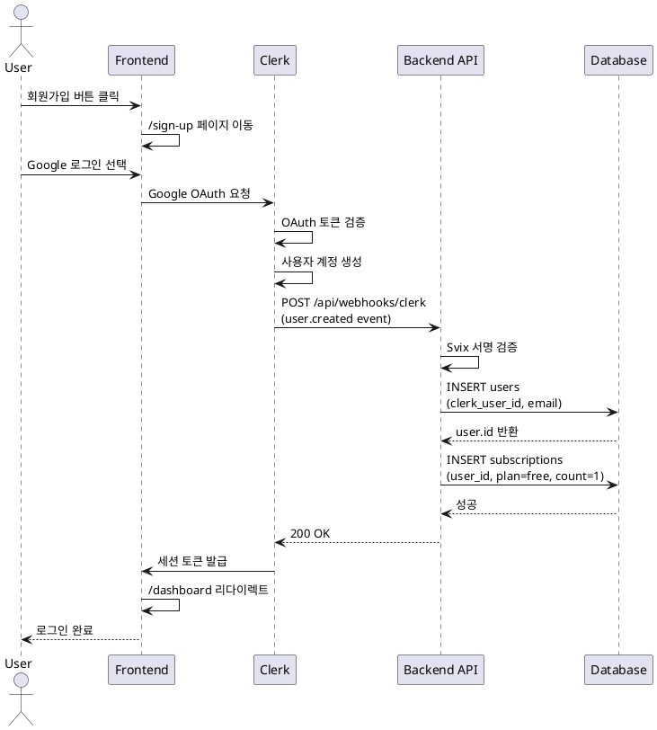

# UC-01: 회원가입

## Primary Actor
신규 사용자

## Precondition
- 사용자가 Google 계정을 보유하고 있음
- 랜딩 페이지에 접근 가능

## Trigger
사용자가 "무료로 시작하기" 버튼 클릭

## Main Scenario

1. 사용자가 `/sign-up` 페이지로 이동
2. Clerk 회원가입 UI에서 Google 로그인 버튼 클릭
3. Google OAuth 동의 화면에서 계정 선택 및 권한 승인
4. Clerk가 Google OAuth 토큰 검증 후 사용자 계정 생성
5. Clerk가 `user.created` Webhook 이벤트 발생
6. 백엔드가 Webhook 수신 및 Svix 서명 검증
7. `users` 테이블에 사용자 프로필 생성 (clerk_user_id, email)
8. `subscriptions` 테이블에 Free 플랜 생성 (remaining_count=1)
9. 사용자가 로그인 상태로 `/dashboard` 또는 `/new-analysis`로 리다이렉트

## Edge Cases

- **Google OAuth 거부**: 회원가입 페이지 유지, 에러 메시지 표시
- **Webhook 검증 실패**: 서버 로그 기록, Clerk 계정은 생성되나 DB 동기화 실패
- **DB 삽입 실패**: 서버 로그 기록, 다음 로그인 시 재시도 필요
- **네트워크 오류**: Clerk 자체 에러 핸들링으로 재시도 유도

## Business Rules

- 회원가입 시 자동으로 Free 플랜 부여
- Free 플랜은 1회 무료 분석 제공
- Clerk Webhook은 배포 환경에서만 작동
- `users`와 `subscriptions`는 트랜잭션으로 동시 생성

## Sequence Diagram

