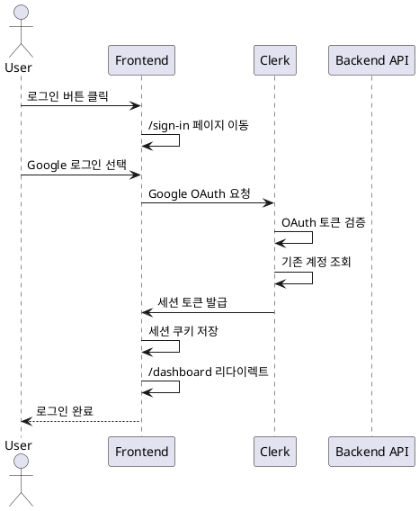

# UC-02: 로그인

## Primary Actor
기존 사용자

## Precondition
- 사용자가 이미 회원가입을 완료한 상태
- Google 계정으로 가입한 이력이 있음

## Trigger
사용자가 로그인 버튼 클릭

## Main Scenario

1. 사용자가 `/sign-in` 페이지로 이동
2. Clerk 로그인 UI에서 Google 계정 선택 버튼 클릭
3. Google OAuth 동의 화면에서 계정 선택
4. Clerk가 Google OAuth 토큰 검증
5. Clerk가 기존 사용자 계정 조회 및 세션 토큰 생성
6. 세션 쿠키 저장
7. 사용자가 로그인 상태로 `/dashboard`로 리다이렉트

## Edge Cases

- **계정 없음**: Clerk 에러 메시지 표시, 회원가입 페이지 링크 제공
- **Google OAuth 거부**: 로그인 페이지 유지, 에러 메시지 표시
- **세션 만료**: 자동 재로그인 유도 또는 로그인 페이지로 리다이렉트
- **네트워크 오류**: Clerk 에러 핸들링으로 재시도 유도

## Business Rules

- 로그인 성공 시 기본적으로 `/dashboard`로 이동
- 이전에 방문하려던 보호된 페이지가 있으면 해당 페이지로 이동
- 세션 유효 기간은 Clerk 설정을 따름

## Sequence Diagram

