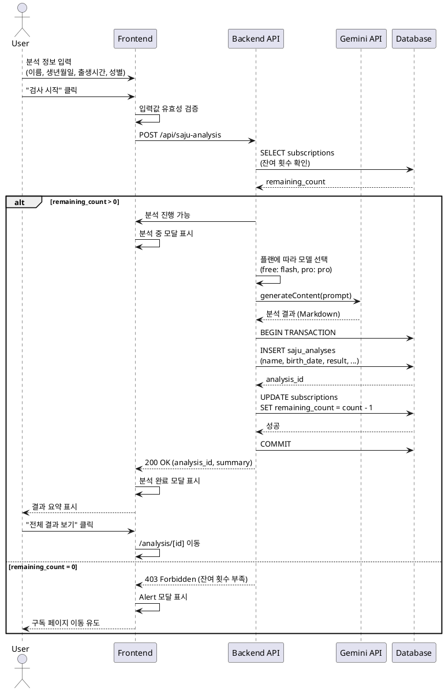

# UC-03: 사주 분석 요청

## Primary Actor
로그인한 사용자

## Precondition
- 사용자가 로그인 상태
- 잔여 분석 횟수가 1회 이상

## Trigger
사용자가 "검사 시작" 버튼 클릭

## Main Scenario

1. 사용자가 `/new-analysis` 페이지에서 정보 입력
   - 이름 (필수)
   - 생년월일 (필수)
   - 출생 시간 (선택, 시/분/초 또는 "모름" 체크)
   - 성별 (필수, 남성/여성)
2. 프론트엔드가 입력값 유효성 검증
3. 백엔드가 구독 정보 조회 및 잔여 횟수 확인
4. 잔여 횟수가 있으면 분석 중 모달 표시
5. 백엔드가 사용자 플랜에 따라 Gemini API 호출
   - Free: gemini-2.5-flash
   - Pro: gemini-2.5-pro
6. Gemini API가 사주 분석 결과 반환 (Markdown)
7. 백엔드가 `saju_analyses` 테이블에 결과 저장
8. 백엔드가 `subscriptions` 테이블에서 잔여 횟수 차감
9. 분석 완료 모달에 결과 요약 표시 (첫 3-4줄)
10. 사용자가 "전체 결과 보기" 클릭 시 `/analysis/[id]`로 이동

## Edge Cases

- **필수 필드 누락**: 해당 필드에 에러 메시지 표시, 제출 방지
- **잔여 횟수 0회 (Free)**: Alert 모달, 구독 페이지 이동 유도
- **잔여 횟수 0회 (Pro)**: Alert 모달, 다음 달 안내
- **Gemini API 오류**: 에러 모달 표시, 재시도 안내, 횟수 차감 롤백
- **Gemini API 타임아웃**: 타임아웃 에러 모달, 재시도 버튼, 횟수 차감 롤백
- **DB 저장 실패**: 에러 모달, 서버 로그 기록, 횟수 차감 롤백
- **동시성 이슈**: 서버에서 잔여 횟수 재검증으로 방지

## Business Rules

- Free 플랜: gemini-2.5-flash 모델 사용
- Pro 플랜: gemini-2.5-pro 모델 사용
- 분석 결과 저장과 횟수 차감은 트랜잭션으로 원자성 보장
- Gemini API 응답 시간: 10-30초 예상
- 출생 시간은 선택 사항 (모름 체크 가능)

## Sequence Diagram

