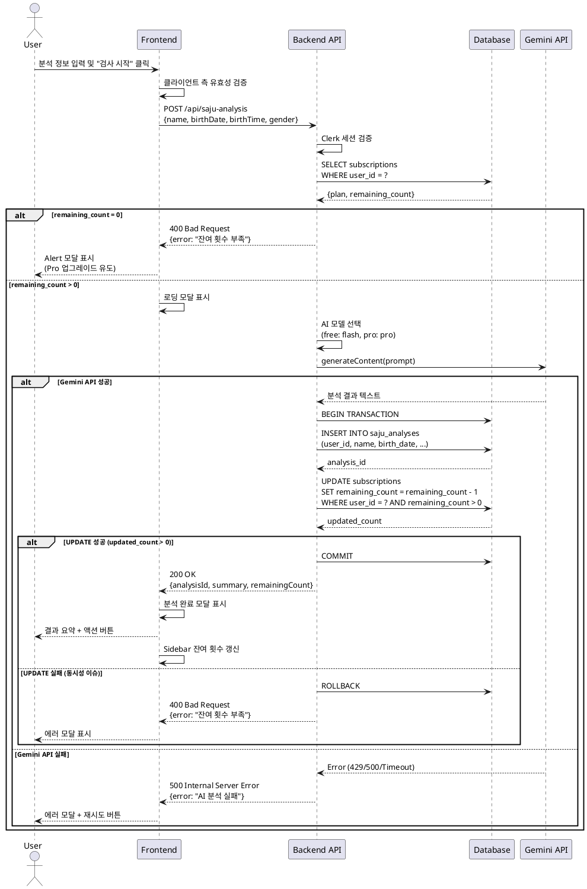

# UC-003: 사주 분석 요청

## Primary Actor
- 인증된 사용자 (Free 또는 Pro 플랜)

## Precondition
- 사용자가 로그인된 상태
- 잔여 분석 횟수가 1회 이상 존재

## Trigger
- 사용자가 `/new-analysis` 페이지에서 "검사 시작" 버튼 클릭

---

## Main Scenario

### 1. 사용자 입력
- 사용자가 새 검사 페이지 접근
- 분석 대상 정보 입력:
  - 이름 (필수)
  - 생년월일 (필수)
  - 출생 시간 (선택, 시/분/초 또는 "모름" 체크)
  - 성별 (필수, 남성/여성)
- "검사 시작" 버튼 클릭

### 2. 클라이언트 검증
- 필수 필드 입력 여부 확인
- 생년월일 형식 검증 (유효한 날짜)
- 출생 시간 형식 검증 (입력된 경우)

### 3. 구독 정보 확인
- 서버에서 사용자 구독 정보 조회
- 잔여 분석 횟수 확인
- 플랜 타입 확인 (free/pro)

### 4. 분석 중 상태 표시
- 로딩 모달 표시
- 예상 소요 시간 안내 (10-30초)
- 사용자 입력 비활성화

### 5. AI 분석 수행
- 플랜에 따른 AI 모델 선택:
  - Free: gemini-2.5-flash
  - Pro: gemini-2.5-pro
- Gemini API 호출 (프롬프트: 명리학 기반 사주 분석)
- 분석 결과 수신 (성격, 재물운, 애정운, 건강운)

### 6. 결과 저장 및 횟수 차감
- 트랜잭션 시작
- saju_analyses 테이블에 분석 결과 저장
- subscriptions 테이블의 remaining_count 1 감소
- 트랜잭션 커밋

### 7. 결과 표시
- 분석 완료 모달로 전환
- 분석 결과 요약 표시 (첫 3-4줄)
- 액션 버튼 제공:
  - "전체 결과 보기" → 분석 상세 페이지
  - "닫기" → 대시보드

### 8. 상태 업데이트
- Sidebar의 잔여 횟수 실시간 갱신

---

## Edge Cases

### E1: 필수 필드 누락
- **발생**: 이름, 생년월일, 성별 미입력
- **처리**: 해당 필드에 에러 메시지 표시, 폼 제출 방지

### E2: 잔여 횟수 0회 (Free 플랜)
- **발생**: Free 플랜 사용자가 1회 분석 이미 사용
- **처리**: Alert 모달 표시, Pro 구독 페이지 이동 유도

### E3: 잔여 횟수 0회 (Pro 플랜)
- **발생**: Pro 플랜 사용자가 월 10회 한도 소진
- **처리**: Alert 모달 표시, 다음 달 이용 안내

### E4: Gemini API 오류
- **발생**: Rate Limit(429), Server Error(500), Timeout(30초 초과)
- **처리**: 
  - 에러 모달 표시
  - 재시도 버튼 제공
  - 잔여 횟수 차감 롤백

### E5: DB 저장 실패
- **발생**: 네트워크 오류, DB 연결 실패
- **처리**:
  - 에러 모달 표시
  - 트랜잭션 롤백 (횟수 차감 취소)
  - 서버 로그 기록

### E6: 동시성 이슈
- **발생**: 여러 탭에서 동시에 분석 요청
- **처리**:
  - 서버에서 잔여 횟수 재검증
  - 먼저 처리된 요청만 성공
  - 나머지 요청은 잔여 횟수 부족 에러 반환

### E7: 세션 만료
- **발생**: 분석 진행 중 세션 만료
- **처리**: 로그인 페이지로 리다이렉트

---

## Business Rules

### BR1: 플랜별 AI 모델
- Free 플랜: gemini-2.5-flash (기본 분석)
- Pro 플랜: gemini-2.5-pro (상세 분석)

### BR2: 잔여 횟수 관리
- Free 플랜: 최초 1회 제공, 소진 시 Pro 업그레이드 필요
- Pro 플랜: 월 10회 제공, 매월 1일 자동 리셋

### BR3: 분석 결과 영구 보관
- 모든 분석 결과는 saju_analyses 테이블에 영구 저장
- 사용자는 대시보드에서 언제든지 과거 분석 조회 가능

### BR4: 트랜잭션 원자성
- 분석 결과 저장과 횟수 차감은 하나의 트랜잭션
- 둘 중 하나라도 실패 시 전체 롤백

### BR5: 동시성 제어
- 서버에서 잔여 횟수 재검증으로 동시 요청 방지
- WHERE remaining_count > 0 조건으로 낙관적 잠금

---

## Sequence Diagram

---

## Post-conditions

### 성공 시
- **Database**:
  - saju_analyses 테이블에 새 레코드 추가
  - subscriptions.remaining_count 1 감소
  - subscriptions.updated_at 갱신
- **UI**:
  - 분석 완료 모달 표시
  - Sidebar 잔여 횟수 업데이트
- **External**:
  - Gemini API 사용량 증가 (비용 발생)

### 실패 시
- **Database**: 트랜잭션 롤백, 데이터 변경 없음
- **UI**: 에러 모달 표시, 재시도 옵션 제공
- **Logs**: 서버 로그에 에러 상세 기록

---

## Related Use Cases
- **선행**: UC-001 회원가입, UC-002 로그인
- **후행**: UC-004 대시보드 조회, UC-005 분석 상세보기
- **연관**: UC-006 Pro 구독 업그레이드 (잔여 횟수 0회 시)

