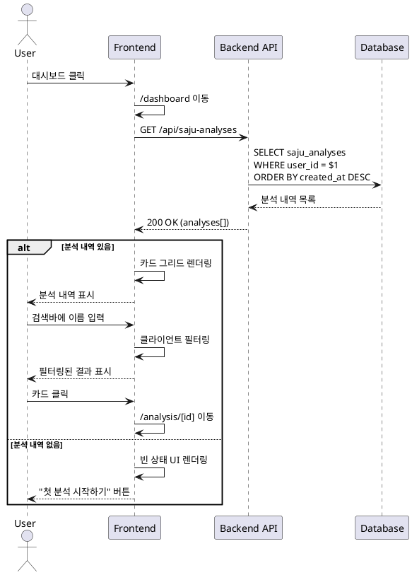

# UC-04: 대시보드 조회

## Primary Actor
로그인한 사용자

## Precondition
- 사용자가 로그인 상태

## Trigger
사용자가 대시보드 메뉴 클릭

## Main Scenario

1. 사용자가 Header 또는 Sidebar에서 대시보드 클릭
2. `/dashboard` 페이지로 이동
3. 백엔드가 현재 사용자의 모든 분석 내역 조회 (최신순)
4. 프론트엔드가 1×3 반응형 카드 그리드로 렌더링
5. 각 카드에 표시:
   - 분석 대상자 이름
   - 생년월일
   - 분석 일시 (상대 시간)
   - 결과 요약 (첫 2줄)
6. 사용자가 검색바에 이름 입력 시 실시간 필터링
7. 사용자가 카드 클릭 시 `/analysis/[id]`로 이동

## Edge Cases

- **분석 내역 없음**: 빈 상태 UI 표시, "첫 분석 시작하기" 버튼 제공
- **검색 결과 없음**: 검색 결과 없음 메시지, 검색어 초기화 버튼
- **DB 조회 오류**: 에러 메시지 표시, 새로고침 버튼
- **네트워크 오류**: 네트워크 에러 메시지, 재시도 버튼
- **세션 만료**: 자동으로 로그인 페이지로 리다이렉트

## Business Rules

- 분석 내역은 최신순으로 정렬 (created_at DESC)
- 검색은 이름 필드에 대해 대소문자 구분 없이 부분 일치
- 검색 필터링은 클라이언트 사이드에서 실시간 처리
- 페이지네이션 없음 (MVP)

## Sequence Diagram

