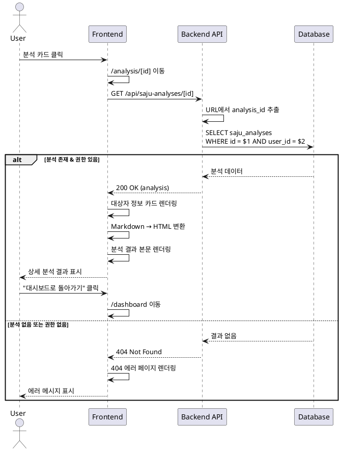

# UC-05: 분석 상세보기

## Primary Actor
로그인한 사용자

## Precondition
- 사용자가 로그인 상태
- 조회하려는 분석이 존재하고 본인 소유

## Trigger
사용자가 대시보드에서 분석 카드 클릭

## Main Scenario

1. 사용자가 대시보드에서 특정 분석 카드 클릭
2. `/analysis/[id]` 페이지로 이동
3. 백엔드가 분석 ID와 사용자 ID로 분석 데이터 조회
4. 프론트엔드가 대상자 정보 카드 렌더링:
   - 이름
   - 생년월일
   - 출생 시간 (입력된 경우만)
   - 성별
   - 분석 일시
   - 사용된 AI 모델 배지
5. 프론트엔드가 분석 결과 본문 렌더링 (Markdown → HTML)
6. 하단에 액션 버튼 표시:
   - "대시보드로 돌아가기"
   - "새 분석 시작"

## Edge Cases

- **잘못된 ID 형식**: 400 에러 페이지 표시
- **분석 없음 또는 권한 없음**: 404 에러 페이지 표시
- **DB 조회 오류**: 에러 메시지 표시, 대시보드로 돌아가기 버튼
- **세션 만료**: 자동으로 로그인 페이지로 리다이렉트

## Business Rules

- 본인이 생성한 분석만 조회 가능 (user_id 검증)
- 분석 결과는 Markdown 형식으로 저장되어 있음
- 분석 데이터는 읽기 전용 (수정 불가)

## Sequence Diagram

