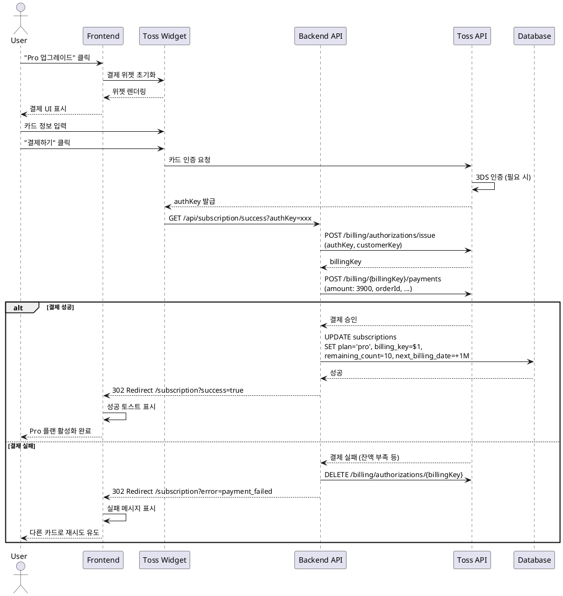

# UC-06: Pro 구독 업그레이드

## Primary Actor
Free 플랜 사용자

## Precondition
- 사용자가 로그인 상태
- 현재 Free 플랜 사용 중

## Trigger
사용자가 "Pro 요금제 업그레이드" 버튼 클릭

## Main Scenario

1. 사용자가 `/subscription` 페이지에서 "Pro 요금제 업그레이드" 클릭
2. 토스페이먼츠 결제 위젯 초기화 및 렌더링
3. 사용자가 카드 정보 입력 (카드번호, 유효기간, CVC)
4. 사용자가 "결제하기" 버튼 클릭
5. 토스페이먼츠가 카드 인증 (3DS 필요 시)
6. 인증 완료 시 `authKey` 발급
7. 백엔드가 `authKey`로 빌링키 발급 API 호출
8. 토스페이먼츠가 빌링키 반환
9. 백엔드가 빌링키로 첫 결제 실행 (₩3,900)
10. 결제 성공 시 `subscriptions` 테이블 업데이트:
    - plan = 'pro'
    - billing_key = 발급받은 빌링키
    - remaining_count = 10
    - next_billing_date = 현재일 + 1개월
11. `/subscription?success=true`로 리다이렉트
12. 성공 토스트 메시지 표시

## Edge Cases

- **결제 위젯 로드 실패**: 에러 메시지, 새로고침 유도
- **사용자가 결제 취소**: failUrl로 리다이렉트, 취소 메시지
- **카드 인증 실패**: 토스페이먼츠 에러 메시지, 재시도 유도
- **빌링키 발급 실패**: 에러 모달, 고객센터 안내
- **첫 결제 실패** (잔액 부족, 한도 초과): 결제 실패 메시지, 다른 카드로 재시도 유도, 빌링키 삭제
- **DB 업데이트 실패**: 에러 로그, 결제 성공했으나 구독 상태 미반영, 관리자 수동 처리
- **네트워크 오류**: 네트워크 에러 메시지, 재시도 버튼

## Business Rules

- Pro 플랜 가격: 월 ₩3,900
- 월 10회 분석 제공
- gemini-2.5-pro 모델 사용
- 빌링키 발급 후 즉시 첫 결제 실행
- 다음 결제일은 현재일 기준 1개월 후
- 결제 성공 시 잔여 횟수 10회로 설정

## Sequence Diagram

