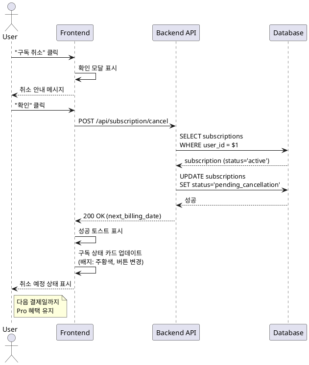

# UC-07: 구독 취소

## Primary Actor
Pro 플랜 사용자 (활성 상태)

## Precondition
- 사용자가 로그인 상태
- 현재 Pro 플랜 활성 상태 (status='active')

## Trigger
사용자가 "구독 취소" 버튼 클릭

## Main Scenario

1. 사용자가 `/subscription` 페이지에서 "구독 취소" 클릭
2. 확인 모달 표시:
   - 메시지: 다음 결제일까지 Pro 혜택 유지 안내
   - 확인/취소 버튼
3. 사용자가 "확인" 클릭
4. 백엔드가 `subscriptions` 테이블 업데이트:
   - status = 'pending_cancellation'
5. 성공 토스트 메시지 표시
6. 구독 정보 카드 업데이트:
   - 구독 상태 배지: "다음 결제일까지 이용 가능" (주황색)
   - "구독 취소" 버튼 숨김
   - "취소 철회" 버튼 표시
7. 다음 결제일까지 Pro 혜택 유지:
   - 잔여 횟수 그대로
   - gemini-2.5-pro 모델 사용 가능

## Edge Cases

- **이미 취소 상태**: 에러 메시지, 페이지 새로고침
- **Free 플랜 사용자**: 에러 메시지 (취소할 구독 없음)
- **DB 업데이트 실패**: 에러 모달, 재시도 버튼
- **네트워크 오류**: 네트워크 에러 메시지, 재시도 버튼

## Business Rules

- 취소 시 즉시 해지되지 않고 'pending_cancellation' 상태로 전환
- 다음 결제일까지 Pro 혜택 유지
- 다음 결제일에 Cron Job이 자동으로 Free 플랜으로 전환
- 취소 철회 가능 (다음 결제일 전까지)

## Sequence Diagram

