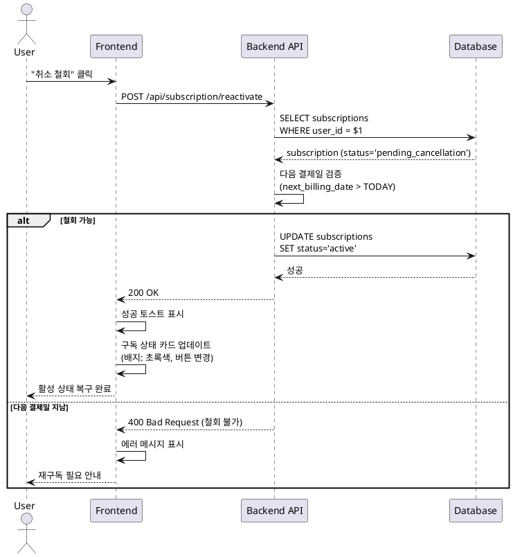

# UC-08: 구독 취소 철회

## Primary Actor
Pro 플랜 사용자 (취소 예정 상태)

## Precondition
- 사용자가 로그인 상태
- 현재 Pro 플랜 취소 예정 상태 (status='pending_cancellation')
- 다음 결제일이 아직 도래하지 않음

## Trigger
사용자가 "취소 철회" 버튼 클릭

## Main Scenario

1. 사용자가 `/subscription` 페이지에서 "취소 철회" 클릭
2. 백엔드가 다음 결제일 검증 (현재 날짜보다 미래인지)
3. 백엔드가 `subscriptions` 테이블 업데이트:
   - status = 'active'
4. 성공 토스트 메시지 표시
5. 구독 정보 카드 업데이트:
   - 구독 상태 배지: "구독 중" (초록색)
   - "취소 철회" 버튼 숨김
   - "구독 취소" 버튼 표시
6. 다음 결제일에 정상적으로 자동 결제 진행

## Edge Cases

- **이미 활성 상태**: 에러 메시지, 페이지 새로고침
- **다음 결제일 지남**: 에러 메시지 (철회 불가, 재구독 필요)
- **DB 업데이트 실패**: 에러 모달, 재시도 버튼
- **네트워크 오류**: 네트워크 에러 메시지, 재시도 버튼

## Business Rules

- 다음 결제일 전까지만 취소 철회 가능
- 철회 시 즉시 활성 상태로 전환
- 다음 결제일에 Cron Job이 정상적으로 자동 결제 실행
- 잔여 횟수 및 다음 결제일은 변경 없음

## Sequence Diagram

