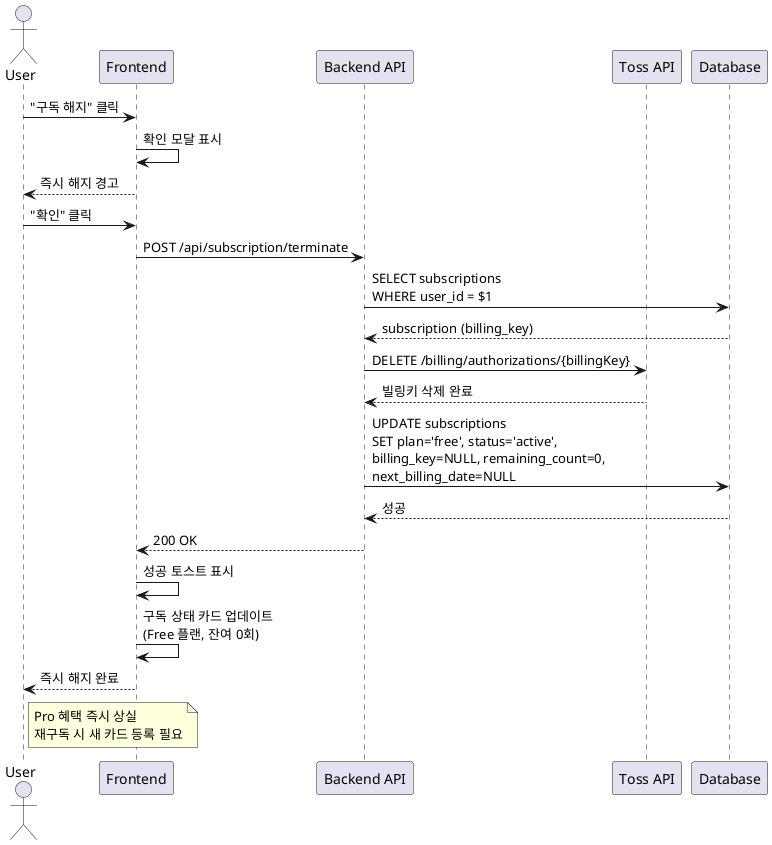

# UC-09: 구독 즉시 해지

## Primary Actor
Pro 플랜 사용자

## Precondition
- 사용자가 로그인 상태
- 현재 Pro 플랜 사용 중 (plan='pro')
- 빌링키가 존재

## Trigger
사용자가 "구독 해지" 버튼 클릭

## Main Scenario

1. 사용자가 `/subscription` 페이지에서 "구독 해지" 클릭
2. 확인 모달 표시:
   - 메시지: 즉시 해지 경고, 빌링키 삭제 안내, 재구독 시 새 카드 등록 필요
   - 확인/취소 버튼
3. 사용자가 "확인" 클릭
4. 백엔드가 토스페이먼츠 빌링키 삭제 API 호출
5. 백엔드가 `subscriptions` 테이블 업데이트:
   - plan = 'free'
   - status = 'active'
   - billing_key = NULL
   - remaining_count = 0
   - next_billing_date = NULL
6. 성공 토스트 메시지 표시
7. 구독 정보 카드 업데이트:
   - 요금제: Free 배지
   - 잔여 횟수: 0회
   - "Pro 요금제 업그레이드" 버튼 표시
8. 즉시 Pro 혜택 상실

## Edge Cases

- **이미 Free 플랜**: 에러 메시지 (해지할 구독 없음)
- **빌링키 삭제 실패**: 에러 로그 기록, DB는 업데이트 진행 (수동 처리 필요)
- **DB 업데이트 실패**: 에러 모달, 재시도 버튼
- **네트워크 오류**: 네트워크 에러 메시지, 재시도 버튼

## Business Rules

- 즉시 해지 시 빌링키 삭제
- 즉시 Free 플랜으로 전환
- 잔여 횟수 0회로 설정
- 재구독 시 새로운 카드 등록 필요
- 다음 결제일까지 기다리지 않고 즉시 해지

## Sequence Diagram

