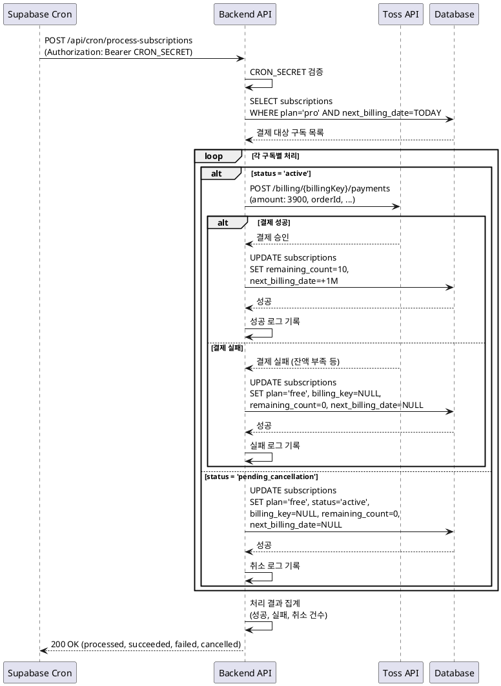

# UC-10: 정기결제 자동 실행

## Primary Actor
Supabase Cron Job

## Precondition
- Cron Job이 올바르게 설정되어 있음
- 환경변수 `CRON_SECRET`이 설정되어 있음

## Trigger
매일 02:00 (KST) Cron Job 트리거

## Main Scenario

1. Supabase Cron Job이 매일 02:00에 실행
2. Cron Job이 Next.js API 호출: `POST /api/cron/process-subscriptions`
3. 백엔드가 `Authorization` 헤더에서 `CRON_SECRET` 검증
4. 백엔드가 오늘이 결제일인 구독 조회:
   - plan = 'pro'
   - next_billing_date = CURRENT_DATE
5. 각 구독별로 순차 처리:
   
   **5-1. 활성 상태 (status='active')**
   - 토스페이먼츠 빌링키 결제 API 호출 (₩3,900)
   - 결제 성공 시:
     - remaining_count = 10
     - next_billing_date = next_billing_date + 1개월
   - 결제 실패 시:
     - plan = 'free'
     - billing_key = NULL
     - remaining_count = 0
     - next_billing_date = NULL
   
   **5-2. 취소 예정 상태 (status='pending_cancellation')**
   - 결제 API 호출 스킵
   - plan = 'free'
   - status = 'active'
   - billing_key = NULL
   - remaining_count = 0
   - next_billing_date = NULL

6. 처리 결과 집계 (성공, 실패, 취소 건수)
7. 서버 로그에 처리 결과 기록
8. Cron Job에 200 OK 응답 반환

## Edge Cases

- **Cron Secret 불일치**: 401 에러 반환, 처리 중단
- **DB 조회 오류**: 에러 로그 기록, 다음 날 재시도
- **토스페이먼츠 API 오류** (500 Server Error): 해당 구독 스킵, 에러 로그, 다음 날 재시도
- **네트워크 타임아웃**: 해당 구독 스킵, 에러 로그, 다음 날 재시도
- **DB 업데이트 실패**: 에러 로그, 결제 성공했으나 구독 상태 미반영, 관리자 수동 처리

## Business Rules

- 매일 02:00 (KST)에 실행
- 오늘이 결제일인 구독만 처리
- 활성 상태: 자동 결제 시도
- 취소 예정 상태: 결제 스킵, Free 전환
- 결제 실패 시 즉시 구독 해지
- 결제 성공 시 잔여 횟수 10회 리셋, 다음 결제일 1개월 연장

## Sequence Diagram

