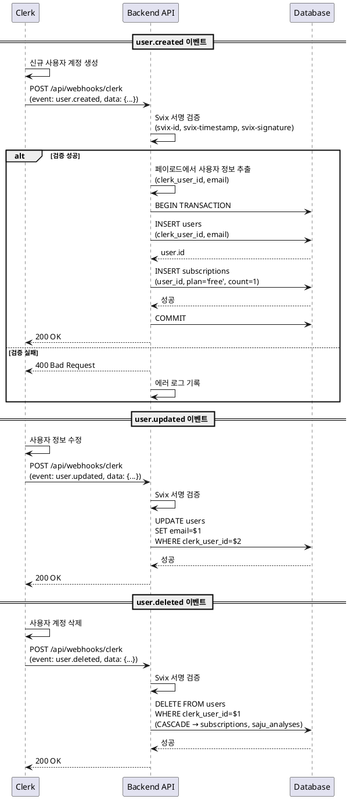

# UC-11: Clerk Webhook 사용자 동기화

## Primary Actor
Clerk 시스템

## Precondition
- Clerk Webhook이 올바르게 설정되어 있음
- 환경변수 `CLERK_WEBHOOK_SECRET`이 설정되어 있음
- 서비스가 배포된 상태 (Webhook은 배포 환경에서만 작동)

## Trigger
Clerk에서 사용자 이벤트 발생 (user.created, user.updated, user.deleted)

## Main Scenario

### user.created 이벤트

1. Clerk에서 신규 사용자 계정 생성 시 Webhook 발생
2. Clerk가 `POST /api/webhooks/clerk` 호출
3. 백엔드가 Svix 서명 헤더 추출 및 검증
4. 백엔드가 페이로드에서 사용자 정보 추출:
   - clerk_user_id (Clerk의 user.id)
   - email
   - first_name, last_name (선택)
5. `users` 테이블에 신규 레코드 삽입
6. `subscriptions` 테이블에 Free 플랜 생성:
   - plan = 'free'
   - status = 'active'
   - remaining_count = 1
7. 트랜잭션으로 users와 subscriptions 동시 생성
8. Clerk에 200 OK 응답 반환

### user.updated 이벤트

1. Clerk에서 사용자 정보 수정 시 Webhook 발생
2. 백엔드가 Svix 서명 검증
3. `users` 테이블 업데이트:
   - email = 새 이메일 (변경된 경우)
4. Clerk에 200 OK 응답 반환

### user.deleted 이벤트

1. Clerk에서 사용자 계정 삭제 시 Webhook 발생
2. 백엔드가 Svix 서명 검증
3. `users` 테이블에서 레코드 삭제:
   - CASCADE로 `subscriptions`, `saju_analyses` 자동 삭제
4. Clerk에 200 OK 응답 반환

## Edge Cases

- **서명 검증 실패**: 400 에러 반환, 처리 중단, 에러 로그
- **환경변수 누락**: 500 에러 반환, 에러 로그
- **DB 삽입 실패** (중복 clerk_user_id): 에러 로그, 이미 존재하면 업데이트로 전환
- **DB 업데이트 실패**: 에러 로그, Clerk에 200 반환 (재시도 방지), 관리자 수동 처리
- **트랜잭션 실패**: 롤백, 에러 로그, Clerk에 500 반환 (재시도 유도)
- **네트워크 오류**: Clerk가 자동 재시도 (exponential backoff)

## Business Rules

- Webhook은 배포 환경에서만 작동
- Svix 서명 검증 필수
- user.created 시 자동으로 Free 플랜 부여
- user.deleted 시 CASCADE DELETE로 관련 데이터 모두 삭제
- 트랜잭션으로 데이터 무결성 보장

## Sequence Diagram

